# Lab 01: Role-Based Access Control

## Lab scenario

You have been asked to create a proof of concept showing how Azure users and groups are created. Also, how role-based access control is used to assign roles to groups. Specifically, you need to:

- Create a Senior Admins group containing the user account of Joseph Price as its member.
- Create a Junior Admins group containing the user account of Isabel Garcia as its member.
- Create a Service Desk group containing the user account of Dylan Williams as its member.
- Assign the Virtual Machine Contributor role to the Service Desk group.  

## Lab objectives

In this lab, you will complete the following exercises

- Exercise 1: Create the Senior Admins group with the user account Joseph Price as its member (the Azure portal). 
- Exercise 2: Create the Junior Admins group with the user account Isabel Garcia as its member (PowerShell).
- Exercise 3: Create the Service Desk group with the user Dylan Williams as its member (Azure CLI). 
- Exercise 4: Assign the Virtual Machine Contributor role to the Service Desk group.

## Estimated timing: 40 minutes

## Architecture Diagram

   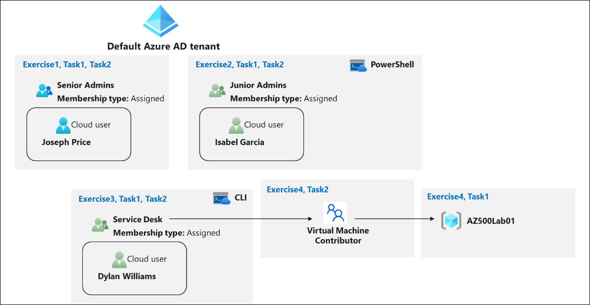

# Exercise 1: Create the Senior Admins group with the user account Joseph Price as its member. 

In this exercise, you will complete the following tasks:

- Task 1: Use the Azure portal to create a user account for Joseph Price.
- Task 2: Use the Azure portal to create a Senior Admins group and add the user account of Joseph Price to the group.

## Task 1: Use the Azure portal to create a user account for Joseph Price 

In this task, you will create a user account for Joseph Price.

1. In the Azure Portal, in the **Search resources, services, and docs** text box at the top of the Azure portal page, type **Microsoft Entra ID (1)** and select **Microsoft Entra ID (2)** from the results. 

   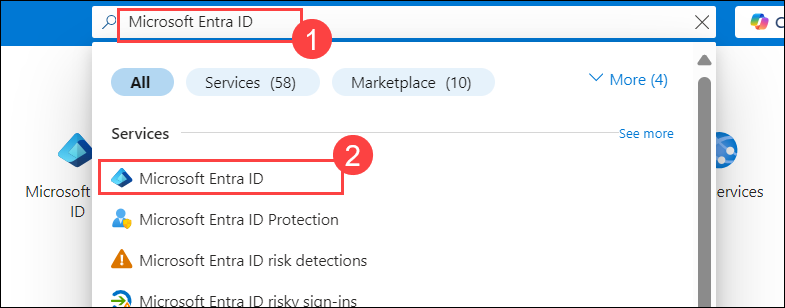

1. On the **Overview** blade of the Microsoft Entra ID tenant, in the **Manage** section, select **Users**.

   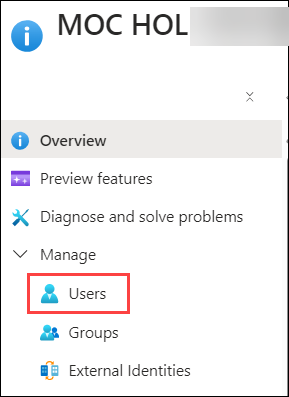

1. Then select **+ New user (1)**, then, in the drop-down menu, click on **Create new user (2)**.

   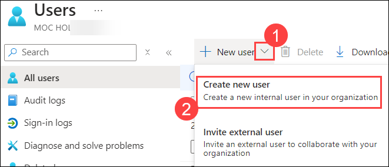

1. On the **New User** blade, ensure that the **Create new user** option is selected, and specify the following settings:

   |Setting|Value|
   |---|---|
   |User principal name|**Joseph (1)**|
   |Display Name|**Joseph Price (2)**|

    - Click on the **copy icon (3)** next to the **User principal name** to copy the full username, and pasted it somewhere.

    - Ensure that the **Auto-generate (4)** password is selected, and click on the copy icon next to **Password (5)** and paste it somewhere. You would need to provide this password, along with the user name to Joseph. 

    - Click on **Review + create (6)**, and then click on **Create**.

      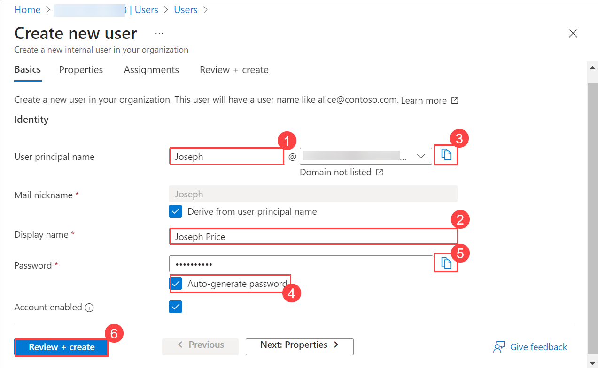

1. Refresh the **Users \| All users** blade to verify the new user was created in your Azure AD tenant.

   

## Task 2: Use the Azure portal to create a Senior Admins group and add the user account of Joseph Price to the group.

In this task, you will create the *Senior Admins* group, add the user account of Joseph Price to the group, and configure it as the group owner.

1. In the Azure portal, navigate back to the blade displaying your Microsoft Entra ID tenant. 

1. In the **Manage** section, click on **Groups**.

   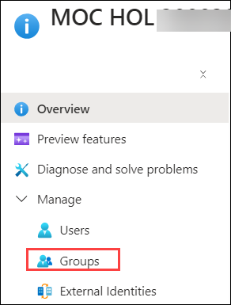

1. Select **+ New group**.
 
1. On the **New Group** blade, specify the following settings (leave others with their default values):

   |Setting|Value|
   |---|---|
   |Group type|**Security (1)**|
   |Group name|**Senior Admins (2)**|
   |Membership type|**Assigned (3)**|
    
    - Click on the **No owners selected (4)** link, on the **Owners** blade, select **Joseph Price (5)**, and click on **Select (6)**.

      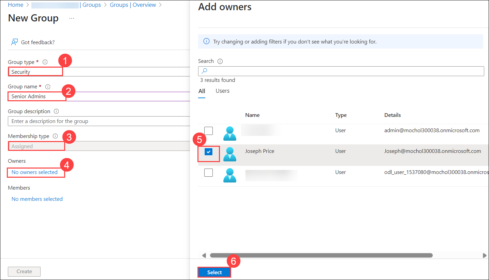

1. Click on the **No members selected (1)** link, on the **Members** blade, search for **Joseph (2)** then select **Joseph Price (3)**, and click on **Select (4)**.

    

1. Back on the **New Group** blade, click on **Create**.

    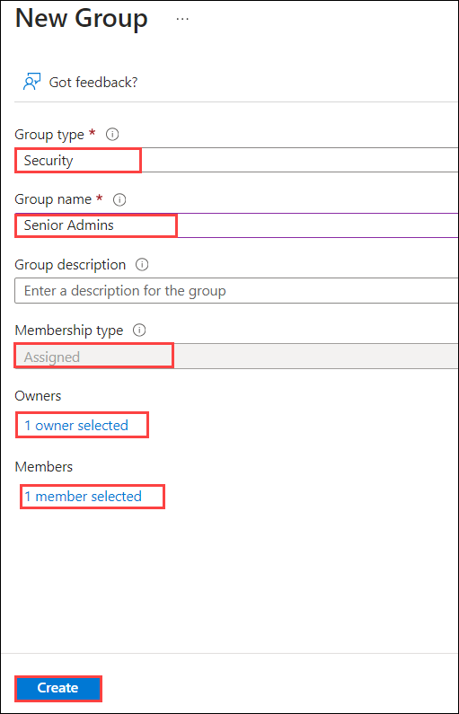

> **Result:** You used the Azure Portal to create a user and a group, and assigned the user to the group. 

# Exercise 2: Create a Junior Admins group containing the user account of Isabel Garcia as its member.

In this exercise, you will complete the following tasks:

- Task 1: Use PowerShell to create a user account for Isabel Garcia.
- Task 2: Use PowerShell to create the Junior Admins group and add the user account of Isabel Garcia to the group. 

## Task 1: Use PowerShell to create a user account for Isabel Garcia.

In this task, you will create a user account for Isabel Garcia by using PowerShell.

1. Open a **Cloud Shell** prompt by selecting the icon shown below.

    

1. At the bottom half of the portal, you may see a message welcoming you to the Azure Cloud Shell, if you have not yet used a Cloud Shell. Select **PowerShell**.

    

1. On the **Getting started**, select **Mount storage account (2)** and select your subscription under storage account subscription **(2)**. Click on **Apply (3)**.

   

1. On the **Mount storage account** tab, select **I want to create a storage account**. Click on **Next**.

    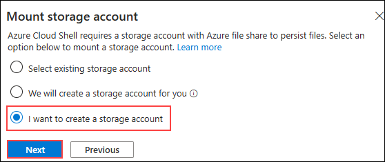

1. On Create storage account page, provide the following details then click on **Create (6)**.

    - **Subscription**: **Leave the default (1)** 
    
    - **Resource group:** **AZ500LAB01(2)**
    
    - **Storage account:** Enter **str<inject key="DeploymentID" enableCopy="false" /> (3)** 
    
    - **File share:** Enter **fileshare<inject key="DeploymentID" enableCopy="false" /> (4)**
    
    - **Region:** **<inject key="Region" enableCopy="false"/> (5)**.

      

1. Once complete, you will see a prompt similar to the one below. Verify that the upper left corner of the Cloud Shell screen shows **PowerShell**.

   

   >**Note**: To paste copied text into the Cloud Shell, right-click within the pane window and select **Paste**. Alternatively, you can use the **Shift+Insert** key combination.

1. In the PowerShell session within the Cloud Shell pane, run the following to create a password profile object:

    ```powershell
    $passwordProfile = New-Object -TypeName Microsoft.Open.AzureAD.Model.PasswordProfile
    ```

1. In the PowerShell session within the Cloud Shell pane, run the following to set the value of the password within the profile object:

    ```powershell
    $passwordProfile.Password = 'Pa55w.rd1234'
    ```

1. In the PowerShell session within the Cloud Shell pane, run the following to connect to Microsoft Entra ID:

    ```powershell
    Connect-AzureAD
    ```
      
1. In the PowerShell session within the Cloud Shell pane, run the following to identify the name of your Microsoft Entra tenant: 

    ```powershell
    $domainName = ((Get-AzureAdTenantDetail).VerifiedDomains)[0].Name
    ```
    ```powershell
    (Get-AzureAdTenantDetail).VerifiedDomains
    ```

        

1. In the PowerShell session within the Cloud Shell pane, run the following to create a user account for Isabel Garcia: 

    ```powershell
    New-AzureADUser -DisplayName 'Isabel Garcia' -PasswordProfile $passwordProfile -UserPrincipalName "Isabel@$domainName" -AccountEnabled $true -MailNickName 'Isabel'
    ```

        

1. In the PowerShell session within the Cloud Shell pane, run the following to list Microsoft Entra ID users (the accounts of Joseph and Isabel should appear on the listed): 

    ```powershell
     Get-AzureADUser -All $true | Select-Object UserPrincipalName, DisplayName
    ```

       

     >**Note:** Please copy and paste the **UserPrincipalName** for Isabel in a notepad, you will be using this in next task.    

## Task 2: Use PowerShell to create the Junior Admins group and add the user account of Isabel Garcia to the group.

In this task, you will create the Junior Admins group and add the user account of Isabel Garcia to the group by using PowerShell.

1. In the same PowerShell session within the Cloud Shell pane, run the following to create a new security group named Junior Admins:
	
    ```powershell
    New-AzureADGroup -DisplayName 'Junior Admins' -MailEnabled $false -SecurityEnabled $true -MailNickName JuniorAdmins
    ```

        

1. In the PowerShell session within the Cloud Shell pane, run the following to **list groups** in your Microsoft Entra tenant (the list should include the Senior Admins and Junior Admins groups):

    ```powershell
    Get-AzureADGroup
    ```

        

1. In the PowerShell session within the Cloud Shell pane, run the following to **obtain a reference** to the user account of Isabel Garcia:

    ```powershell
    $user = Get-AzureADUser -Filter "UserPrincipalName eq '< UserPrincipalName>'"
    ```

     >**Note:** Replace the **< UserPrincipalName>** with the name you have copied for Isabel in Task1->12th step.

1. In the PowerShell session within the Cloud Shell pane, run the following to add a user account of Isabel to the Junior Admins group:
	
    ```powershell
    Add-AzADGroupMember -MemberUserPrincipalName $user.userPrincipalName -TargetGroupDisplayName "Junior Admins" 
    ```

1. In the PowerShell session within the Cloud Shell pane, run the following to verify that the Junior Admins group contains a user account of Isabel:

    ```powershell
    Get-AzADGroupMember -GroupDisplayName "Junior Admins"
    ```

            

     > **Result:** You used PowerShell to create a user and a group account, and added the user account to the group account. 

# Exercise 3: Create a Service Desk group containing the user account of Dylan Williams as its member.

In this exercise, you will complete the following tasks:

- Task 1: Use Azure CLI to create a user account for Dylan Williams.
- Task 2: Use Azure CLI to create the Service Desk group and add a user account of Dylan to the group. 

## Task 1: Use Azure CLI to create a user account for Dylan Williams.

In this task, you will create a user account for Dylan Williams.

1. In the drop-down menu in the upper-left corner of the Cloud Shell pane, select **Switch to Bash**, and, when prompted.

   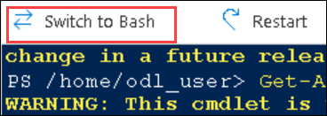

1. Click on **Confirm**. 

1. In the Bash session within the Cloud Shell pane, run the following commands to identify the name of your Microsoft Entra tenant:

    ```cli
    DOMAINNAME=$(az ad signed-in-user show --query 'userPrincipalName' | cut -d '@' -f 2 | sed 's/\"//')
    ```

    ```cli
    echo $DOMAINNAME
    ```    

1. In the Bash session within the Cloud Shell pane, run the following to create a user, Dylan Williams. Use *yourdomain*.
 
    ```cli
    az ad user create --display-name "Dylan Williams" --password "Pa55w.rd1234" --user-principal-name Dylan@$DOMAINNAME
    ```

    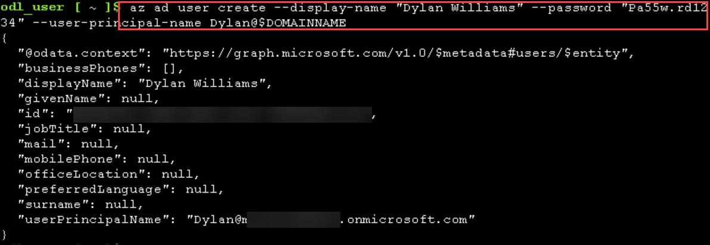        
      
1. In the Bash session within the Cloud Shell pane, run the following to list Azure AD user accounts (the list should include user accounts of Joseph, Isabel, and Dylan)
	
    ```cli
    az ad user list --output table
    ```

             

## Task 2: Use Azure CLI to create the Service Desk group and add a user account of Dylan to the group. 

In this task, you will create the Service Desk group and assign Dylan to the group. 

1. In the same Bash session within the Cloud Shell pane, run the following to create a new security group named Service Desk.

    ```cli
    az ad group create --display-name "Service Desk" --mail-nickname "ServiceDesk"
    ```
 
1. In the Bash session within the Cloud Shell pane, run the following to list the Microsoft Entra ID groups (the list should include Service Desk, Senior Admins, and Junior Admins groups):

    ```cli
    az ad group list -o table
    ```

             

1. In the Bash session within the Cloud Shell pane, run the following to obtain a reference to the user account of Dylan Williams: 

    ```cli
    USER=$(az ad user list --filter "displayname eq 'Dylan Williams'")
    ```

1. In the Bash session within the Cloud Shell pane, run the following to obtain the objectId property of the user account of Dylan Williams: 

    ```cli
    OBJECTID=$(echo $USER | jq '.[].id' | tr -d '"')
    ```

1. In the Bash session within the Cloud Shell pane, run the following to add a user account of Dylan to the Service Desk group: 

    ```cli
    az ad group member add --group "Service Desk" --member-id $OBJECTID
    ```

1. In the Bash session within the Cloud Shell pane, run the following to list members of the Service Desk group and verify that it includes the user account of Dylan:

    ```cli
    az ad group member list --group "Service Desk"
    ```

    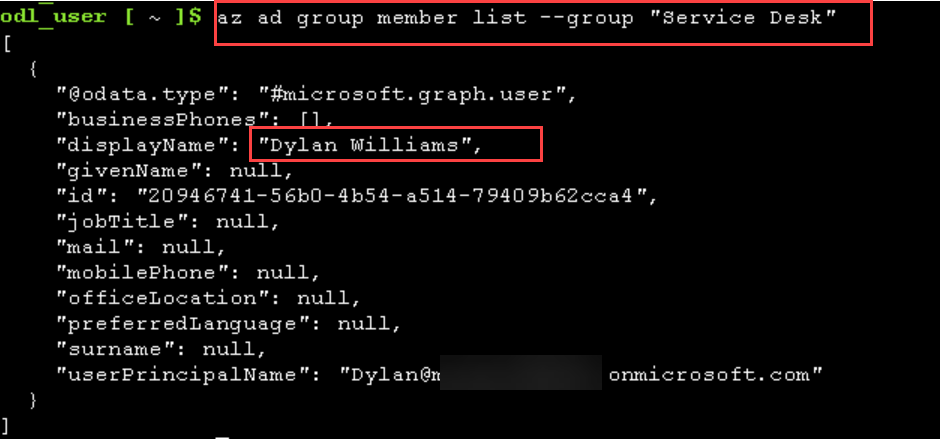         

1. Close the Cloud Shell pane.

    > **Result:** Using Azure CLI you created a user and a group accounts, and added the user account to the group. 


# Exercise 4: Assign the Virtual Machine Contributor role to the Service Desk group.

In this exercise, you will complete the following task:

- Task 1: Assign the Service Desk Virtual Machine Contributor permissions to the resource group.   

## Task 1: Assign the Service Desk Virtual Machine Contributor permissions. 

1. In the Azure portal, in the **Search resources, services, and docs** text box at the top of the Azure portal page, type **Resource groups (1)** and select **Resource groups (2)** from the services.

   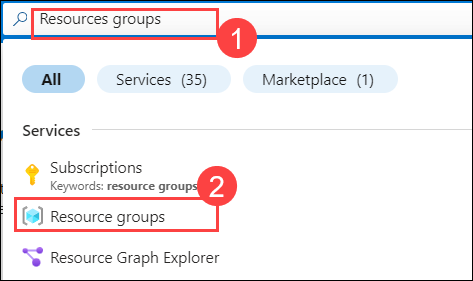

1. On the **Resource groups** blade, click on the **AZ500LAB01** resource group entry.

1. On the **AZ500Lab01** blade, click on **Access control (IAM)**.

1. On the **AZ500Lab01 \| Access control (IAM) (1)** blade, click on **+ Add (2)** and then, in the drop-down menu, click on **Add role assignment (3)**.

   

1. On the **Add role assignment** blade, specify the following settings and click Next after each step

    - Select **Job function roles (1)**

    - Search and select **Virtual Machine Contributor (2)(3)**
    
    - Click **Next (4)** 
   
      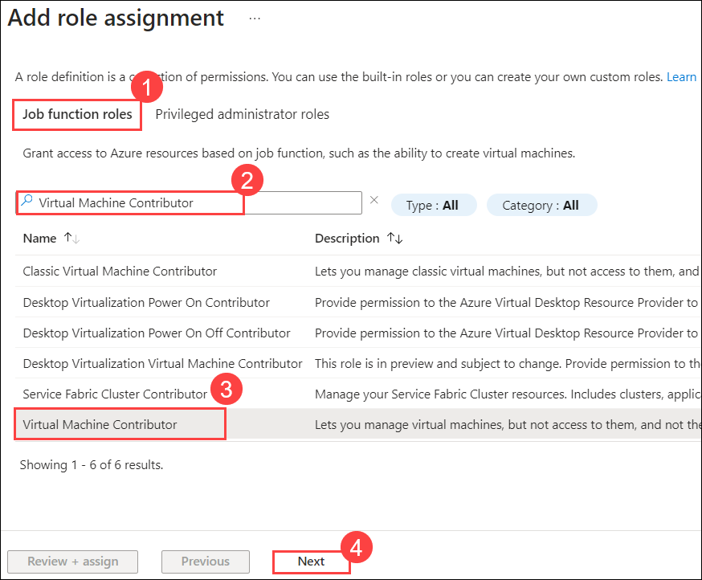

1. On the Add role assignment page, provide the following deatils.

    - Assign access to (Under Members Pane)**User, group, or service principal (1)**

    - Select **+Select Members (2)**
    
    - Search and select **Service Desk (3)(4)** 
    
    - Click on **Select (5)**

      

1. Click on **Review + assign** twice to create the role assignment.

1. From the **Access control (IAM)** blade, click on the **Check access** tab.

1. On the **AZ500Lab01 \| Access control (IAM) (1)** blade, click on the **Check access (2)** button under check access, and then in the **Search by name or email address** text box, type **Dylan Williams (3)**.

      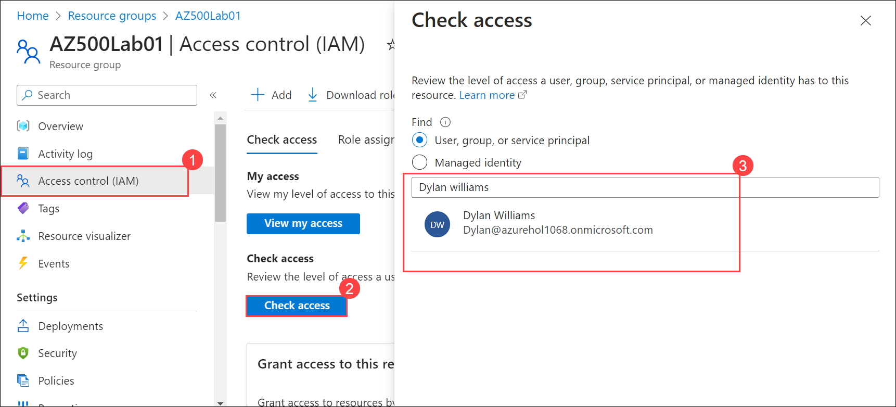

1. In the list of search results, select the user account of Dylan Williams and, on the **Dylan Williams assignments - AZ500Lab01** blade, view the newly created assignment.

   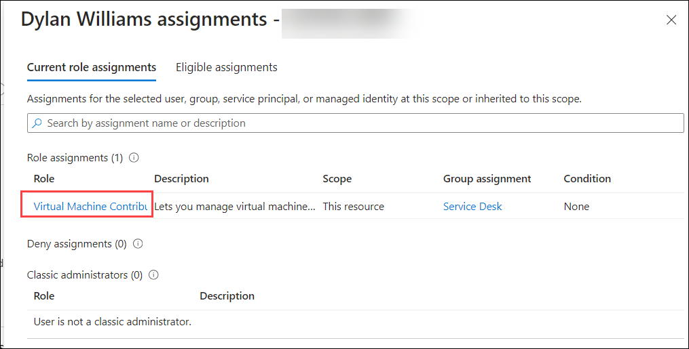

1. Close the **Dylan Williams assignments - AZ500Lab01** blade.

1. Repeat the same last two steps to check access for **Joseph Price**. 

> **Result:** You have assigned and checked RBAC permissions. 
 
> **Congratulations** on completing the task! Now, it's time to validate it. Here are the steps:
   - Hit the Validate button for the corresponding task.
   - If you receive a success message, you can proceed to the next task.
   - If not, carefully read the error message and retry the step, following the instructions in the lab guide.
   - If you need any assistance, please contact us at labs-support@spektrasystems.com. We are available 24/7 to help you out.
 
   <validation step="b8b0d15c-4752-41bc-86ee-10bb1220b83e" />

### You have successfully completed the lab
