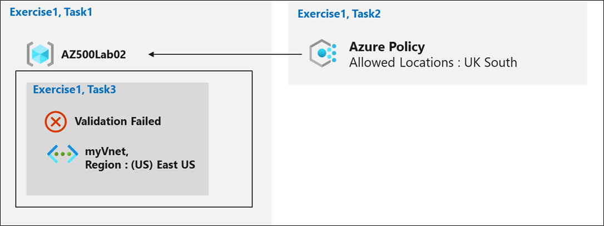

# Lab 02 - Azure Policy

## Lab scenario

You have been asked to create a proof of concept showing how Azure policy can be used. Specifically, you need to:

- Create an Allowed Locations policy that ensures resources are only created in a specific region.
- Test to ensure resources are only created in the Allowed location.

## Lab objectives

In this lab, you will complete the following:

- Exercise 1: Implement Azure Policy.

## Estimated timing: 30 minutes

## Architecture diagram

## Exercise 1: Implement Azure Policy

In this exercise, you will complete the following tasks:

- Task 1: Create an Allowed Locations policy assignment.
- Task 2: Verify the Allowed Locations policy assignment is working. 

### Task 1: Create an Allowed Locations policy assignment

In this task, you will create an Allowed Locations policy assignment and specify which Azure regions the policy can use.

1. In the Azure portal, in the **Search resources, services, and docs** text box at the top of the Azure portal page, type **Policy** and press the **Enter** key.

1. On the **Policy** blade, in the **Authoring** section, select **Definitions**.

1. Take a minute to browse the built-in definitions. Use the **Category** drop-down to filter the list of policies.

1. In the **Search** text box, type **Allowed locations**. 

   >**Note**: The **Allowed locations** policy allows you to restrict location of resources, not resource groups. To restrict locations of resource groups, you can use the **Allowed locations for resource groups** policy.

1. Click on the **Allowed locations** policy definition to display its details.

   >**Note**: This policy definition takes an array of locations as parameters. A policy rule is an ‘if-then’ statement. The ‘if’ clause checks if the resource location is included in the parameter list, and if not, the ‘then’ clause denies the resource creation or, for existing resources, marks them as non-compliant.

1. On the **Allowed locations** blade, click on **Assign**.

   
   

1. On the **Basics** tab of the **Allowed locations** blade, click on the Ellipsis (...) button next to the **Scope** text box and, on the **Scope** blade, specify the following settings:

   |Setting|Value|
   |---|---|
   |Subscription|**CloudLabsAI.com DS - 079**|
   |Resource group|**AZ500LAB02**|

1. Click on **Select**.

    

1. On the **Allowed locations** blade, on the **Basics** tab, specify the following settings (leave others with their default values):

   |Setting|Value|
   |---|---|
   |Assignment name|**Allow UK South for AZ500LAB02**|
   |Description|**Allow resources to be created in UK South Only for AZ500LAB02**|
   |Policy enforcement|**Enabled**|

1. Click on **Parameters** tab.

1. On the **Parameters** tab of the **Allowed locations** blade, in the **Allowed locations** drop-down list, select **UK South** as the only allowed location.

   

   >**Note**: You can select more than one location. If the policy required a different set of parameters, this tab would provide those selections. 

1. Click on **Review + create**, followed by **Create** to create the policy assignment. 

   >**Note**: You will see a notification that the assignment was successful, and that the assignment might take around 30 minutes to complete.

   >**Note**: The reason the Azure policy assignment might take up to 30 minutes to take effect is that is has to replicate globally. Typically this takes only a few minutes.  If the next task fails, simply wait a few minutes and attempt its steps again.

### Task 2: Test the Allowed Locations policy assignment

In this task, you will test the Allowed Locations policy assignment. 

1. In the Azure portal, in the **Search resources, services, and docs** text box at the top of the Azure portal page, type **Virtual networks** and press the **Enter** key.

1. On the **Virtual Networks** blade, click on **+ Create**.

   >**Note**: First, you will try to create a virtual network in East US. Since this is not an allowed location, the request should be blocked. 

1. On the **Basics** tab of the **Create virtual network** blade, specify the following settings (leave others with their default values):

    |Setting|Value|
    |---|---|
    |Resource group|**AZ500LAB02**|
    |Name|**myVnet**|
    |Region|**(US) East US**|

1. Click on **Review + create**. 

   
 
1. Click on **Create**. 

    > **Note**: You will receice **Deployment Failed** notification. This is the expected output since we are allowing to create resources only in the (Europe) UK South and restricting other regions using Azurepolicy.

1. Perform Previous **1-3** steps again of task 2 and create **virtual network** again, This time in the **Region** drop-down list, select **(Europe) UK South**.

   

1. Click on **Review + create**, verify that validation passed, click on **Create**, and verify that the virtual network was created successfully. 

   > **Results**: In this exercise, you learned to apply an Azure policy by selecting a built-in policy definitions and assigning it to a resource group.
 
> **Congratulations** on completing the task! Now, it's time to validate it. Here are the steps:
   - If you receive a success message, you can proceed to the next task.
   - If not, carefully read the error message and retry the step, following the instructions in the lab guide.
   - If you need any assistance, please contact us at labs-support@spektrasystems.com. We are available 24/7 to help you out.
 
   <validation step="c3fc6e5c-5f14-4738-9d8d-3bae5ea2c640" />
   
## Review
In this lab, you have completed:
- Created an Allowed Locations policy assignment.
- Tested the Allowed Locations policy assignment.

### You have successfully completed the lab

