# Lab 03: Azure Firewall

## Lab scenario

You have been asked to install Azure Firewall. This will help your organization control inbound and outbound network access which is an important part of an overall network security plan. Specifically, you would like to create and test the following infrastructure components:

- A virtual network with a workload subnet and a jump host subnet.
- A virtual machine is each subnet. 
- A custom route that ensures all outbound workload traffic from the workload subnet must use the firewall.
- Firewall Application rules that only allow outbound traffic to www.bing.com. 
- Firewall Network rules that allow external DNS server lookups.

> For all the resources in this lab, we are using the **East US** region.

## Lab objectives

In this lab, you will complete the following exercise:

- Exercise 1: Deploy and test an Azure Firewall

## Estimated timing: 40 minutes

## Architecture Diagram

   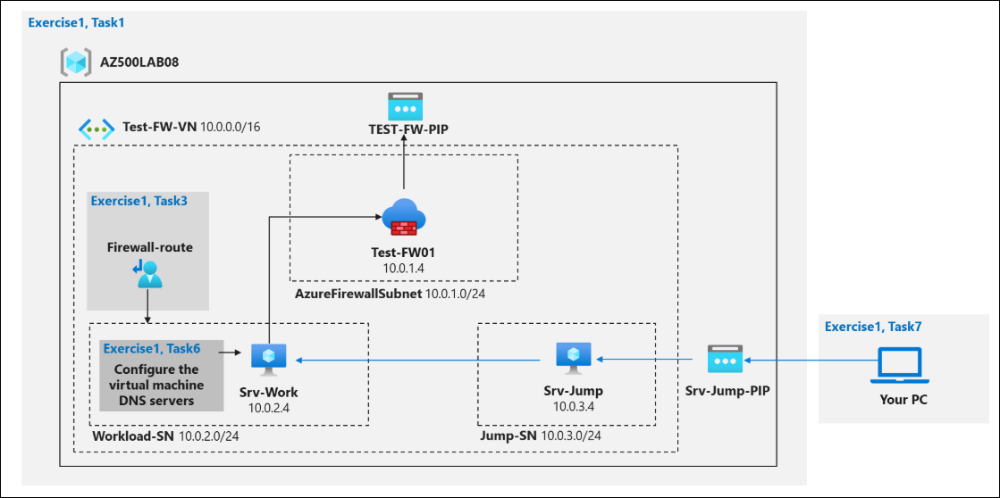

# Exercise 1: Deploy and test an Azure Firewall

> For all the resources in this lab, we are using the **East (US)** region. Verify with your instructor this is region to use for you class. 

In this exercise, you will complete the following tasks:

- Task 1: Use a template to deploy the lab environment. 
- Task 2: Deploy an Azure firewall.
- Task 3: Create a default route.
- Task 4: Configure an application rule.
- Task 5: Configure a network rule. 
- Task 6: Configure DNS servers.
- Task 7: Test the firewall. 

## Task 1: Use a template to deploy the lab environment. 

In this task, you will review and deploy the lab environment. 

In this task, you will create a virtual machine by using an ARM template. This virtual machine will be used in the last exercise for this lab.

1. In the Azure portal, in the **Search resources, services, and docs** text box at the top of the Azure portal page, type/search **Deploy a custom template (1)** and select **Deploy a custom template (2)** from the services.

   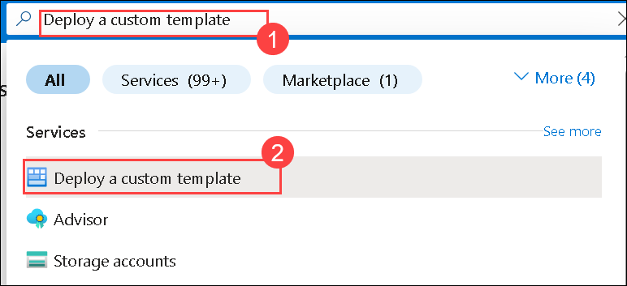

1. On the **Custom deployment** blade, click the **Build your own template in the editor** option.

   

1. On the **Edit template** blade, click **Load file**.

   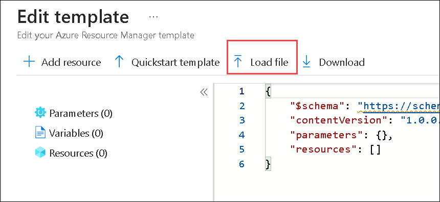

1. Navigate to the **C:\AllFiles\AZ500-AzureSecurityTechnologies-lab-files\Allfiles\Labs\08** folder, then select **template.json** file and then click **Open**.

   >**Note**: Review the content of the template and note that it deploys an Azure VM hosting Windows Server 2016 Datacenter.

1. On the **Edit template** blade, click **Save**.

   

1. On the **Custom deployment** blade, ensure that the following settings are configured (leave any others with their default values) and then click on **Review+create (4)**.

   |Setting|Value|
   |---|---|
   |Subscription|**Leave the default Subscription (1)**|
   |Resource group|Click **Create new**, type the name **AZ500LAB03** and then click **(OK)** **(2)**|
   |Location|**(US) East US (3)**|

   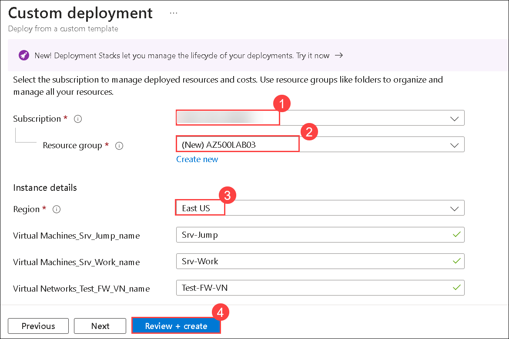   

    >**Note**: To identify Azure regions where you can provision Azure VMs, refer to [**https://azure.microsoft.com/en-us/regions/offers/**](https://azure.microsoft.com/en-us/regions/offers/)

1. Then click **Create**.

    >**Note**: Wait for the deployment to complete. This should take about 2 minutes. 

## Task 2: Deploy the Azure firewall

In this task you will deploy the Azure firewall into the virtual network. 

1. In the Azure portal, in the **Search resources, services, and docs** text box at the top of the Azure portal page, type/search **Firewalls (1)** and select **Firewalls (2)**.

   

1. On the **Firewalls** blade, click **+ Create**.

   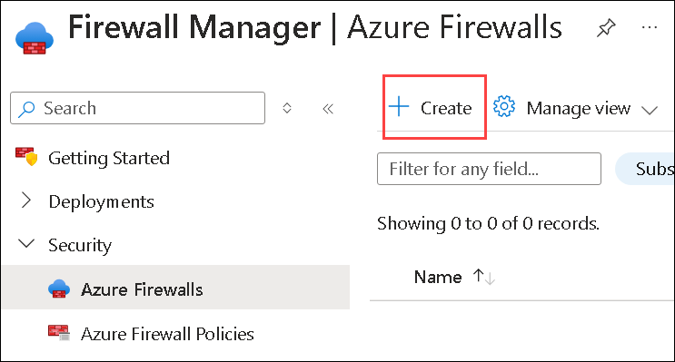

1. On the **Basics** tab of the **Create a firewall** blade, specify the following settings (leave others with their default values) and click on **Next:Tags> (11)**.

   |Setting|Value|
   |---|---|
   |Subscription|**Leave the default Subscription (1)**|   
   |Resource group|**AZ500LAB03 (2)**|
   |Name|**Test-FW01 (3)**|
   |Region|**(US) East US (4)**|
   |Firewall SKU|**Standard (5)**|

    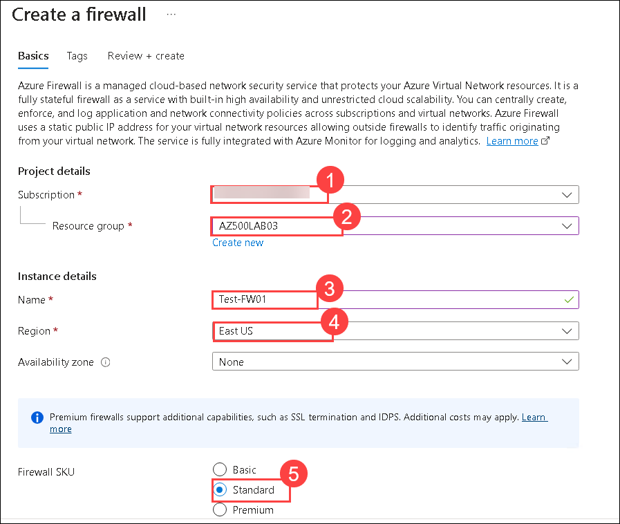  

   |Setting|Value|
   |---|---|    
   |Firewall management|**Use Firewall rules (classic) to manage this firewall (6)**|
   |Choose a virtual network|click the **Use existing (7)** option|
   |Virtual network|Select **Test-FW-VN (8)**- If you get any errror please uncheck the **Enable Firewal Management NIC** under *Firewall Management NIC* |   
   |Public IP address|click **Add new** and type the name **TEST-FW-PIP** and click **OK** **(9)**|
   |Enable Firewal Management NIC|**Uncheck the box (10)**|   

         

1. Naviagte to **Review + create** tab at the top.

1. Once the validation is passed ,click **Create**. 

    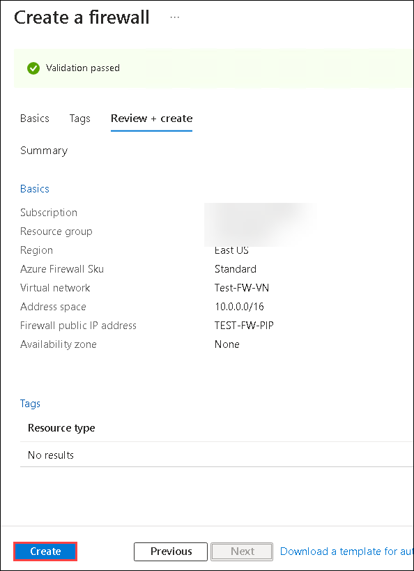  

     >**Note**: You might need to scroll up to see the **Review + create**, Wait for the deployment to complete. This should take about 5 -10 minutes. 

1. In the Azure portal, in the **Search resources, services, and docs** text box at the top of the Azure portal page, type/search for **Resource groups (1)** and select **Resource groups (2)**.

    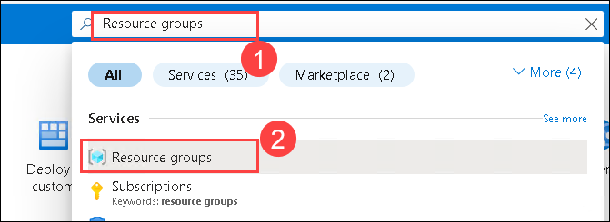  

1. On the **Resource groups** blade, in the list of resource group, click the **AZ500LAB03** entry.

    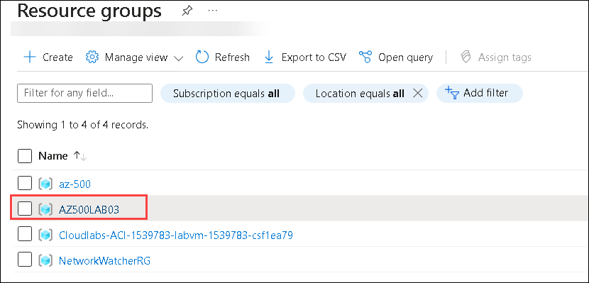  

     >**Note**: On the **AZ500LAB03** resource group blade, review the list of resources. You can sort by **Type**.

1. In the list of resources, click the entry representing the **Test-FW01** firewall.

      

1. On the **Test-FW01** blade, identify the **Private IP** address that was assigned to the firewall. Copy and paste the Private IP in a notepad.

      

    >**Note**: You will need this information in the next task.

## Task 3: Create a default route

In this task, you will create a default route for the **Workload-SN** subnet. This route will configure outbound traffic through the firewall.

1. In the Azure portal, in the **Search resources, services, and docs** text box at the top of the Azure portal page, type/search for **Route tables (1)** and select **Route tables (2)**.

    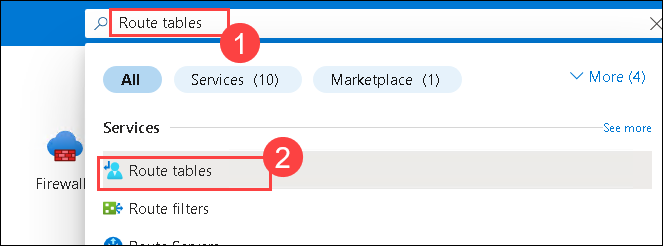  

1. On the **Route tables** blade, click **+ Create**.

1. On the **Create route table** blade, specify the following settings and then click on **Review+create (5)**.

   |Setting|Value|
   |---|---|
   |Subscription|**Leave the default Subscription (1)**|   
   |Resource group|**AZ500LAB03 (2)**|
   |Region| **East US (3)**|
   |Name|**Firewall-route (4)**|

   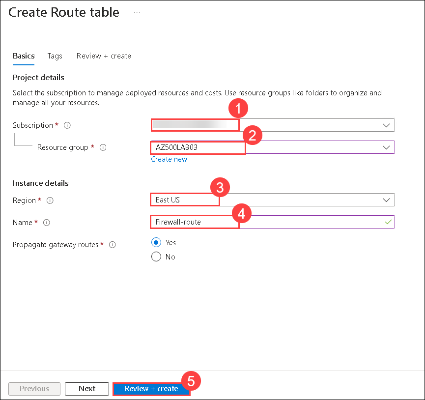     

1. Then click **Create**, and wait for the provisioning to complete. 

1. On the **Route tables** blade, click **Refresh**, and, in the list of route tables, click the **Firewall-route** entry.

1. On the **Firewall-route** blade, in the **Settings** section, click **Subnets (1)** and then, on the **Firewall-route \| Subnets** blade, click **+ Associate (2)**.

    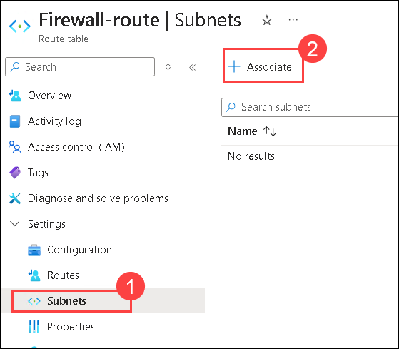  

1. On the **Associate subnet** blade, specify the following settings and then click on **OK (3)**.

   |Setting|Value|
   |---|---|
   |Virtual network|**Test-FW-VN (1)**|
   |Subnet|**Workload-SN (2)**|

   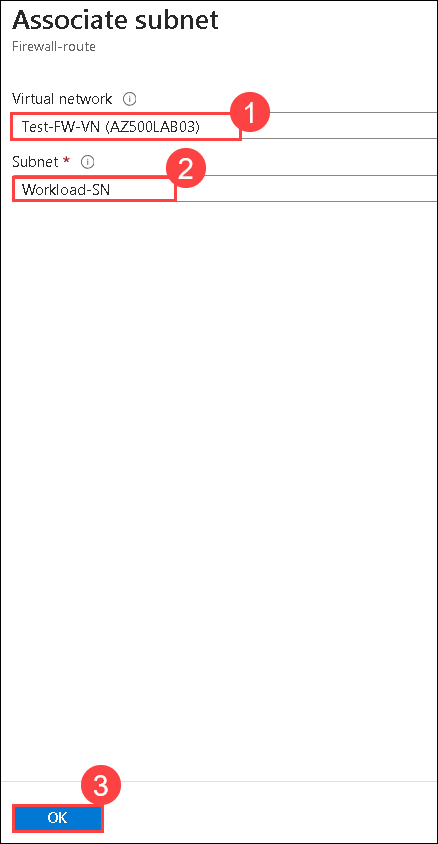     

    >**Note**: Ensure the **Workload-SN** subnet is selected for this route, otherwise the firewall won't work correctly.

1. Back on the **Firewall-route** blade, in the **Settings** section, click **Routes (1)** and then click **+ Add (2)**. 

      

1. On the **Add route** blade, specify the following settings and then click on **Add (6)**. 

   |Setting|Value|
   |---|---|
   |Route name|**FW-DG (1)**|
   |Destination type|**IP Adresses (2)**|
   |Destination IP addresses/CIDR ranges|**0.0.0.0/0 (3)**|
   |Next hop type|**Virtual appliance (4)**|
   |Next hop address|the private IP address of the firewall that you identified in the previous task **(5)**|

   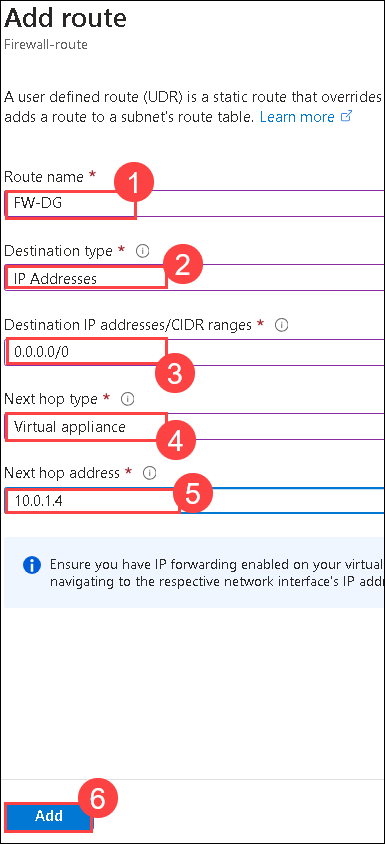     

    >**Note**: Azure Firewall is actually a managed service, but virtual appliance works in this situation.
	
## Task 4: Configure an application rule

In this task you will create an application rule that allows outbound access to `www.bing.com`.

1. In the Azure portal, navigate back to the overview panel of **Test-FW01** firewall .

1. On the **Test-FW01** blade, in the **Settings** section, click **Rules (classic) (1)**. On the **Test-FW01 \| Rules (classic)** blade, click the **Application rule collection (2)** tab, and then click **+ Add application rule collection (3)**.

      

1. On the **Add application rule collection** blade, specify the following settings (leave others with their default values) and then click on **Add (9)**.

   |Setting|Value|
   |---|---|
   |Name|**App-Coll01 (1)**|
   |Priority|**200 (2)**|
   |Action|**Allow (3)**|

    - On the **Add application rule collection** blade, create a new entry in the **Target FQDNs** section with the following settings (leave others with their default values):

      |Setting|Value|
      |---|---|
      |name|**AllowGH (4)**|
      |Source type|**IP Address (5)**|
      |Source|**10.0.2.0/24 (6)**|
      |Protocol port|**http:80, https:443 (7)**|
      |Target FQDNS|Type **www.bing.com (8)**|

      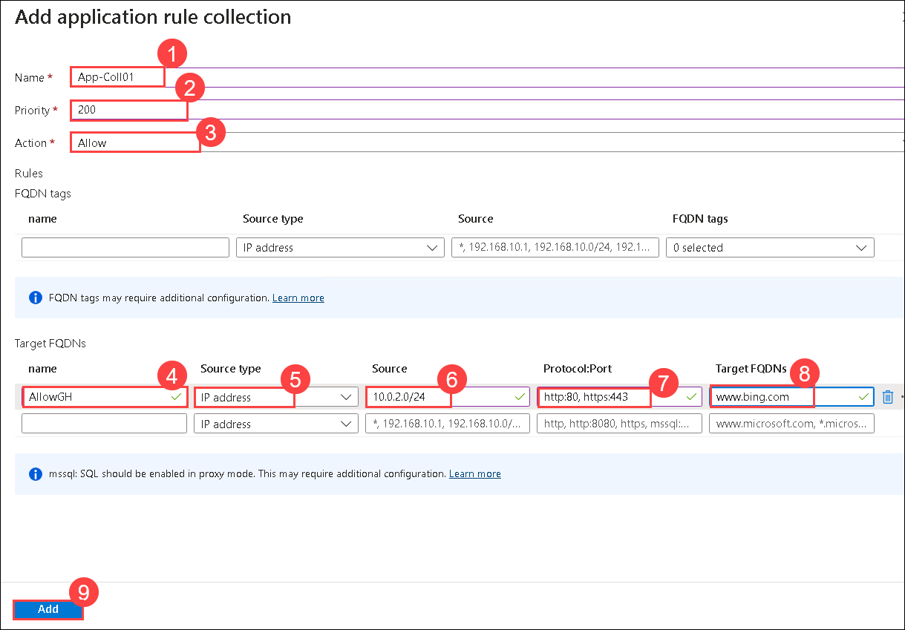  

      >**Note**: Azure Firewall includes a built-in rule collection for infrastructure FQDNs that are allowed by default. These FQDNs are specific for the platform and can't be used for other purposes. 

## Task 5: Configure a network rule

In this task, you will create a network rule that allows outbound access to two IP addresses on port 53 (DNS).

1. In the Azure portal, navigate back to the **Test-FW01 \| Rules (classic)** blade.

1. On the **Test-FW01 \| Rules (classic) (1)** blade, click the **Network rule collection (2)** tab and then click **+ Add network rule collection (3)**.

    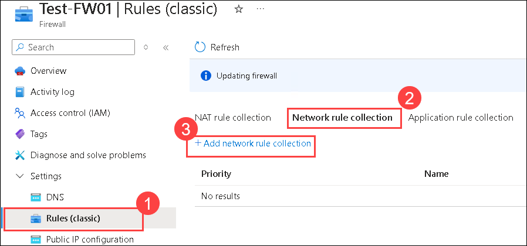  

1. On the **Add network rule collection** blade, specify the following settings (leave others with their default values) and then click on **Add (11)**.

   |Setting|Value|
   |---|---|
   |Name|**Net-Coll01 (1)**|
   |Priority|**200 (2)**|
   |Action|**Allow (3)**|

    - On the **Add network rule collection** blade, create a new entry in the **IP Addresses** section with the following settings (leave others with their default values):

      |Setting|Value|
      |---|---|
      |Name|**AllowDNS (4)**|
      |Protocol|**UDP (5)**|
      |Source type|**IP address (6)**|
      |Source Addresses|**10.0.2.0/24 (7)**|
      |Destination type|**IP address (8)**|
      |Destination Address|**209.244.0.3,209.244.0.4 (9)**|
      |Destination Ports|**53 (10)**|

      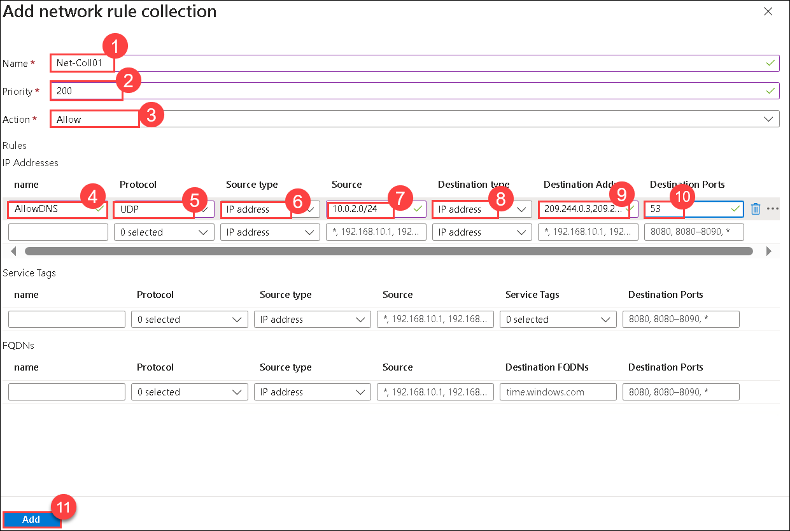  

      >**Note**: The destination addresses used in this case are known public DNS servers. 

## Task 6: Configure the virtual machine DNS servers

In this task, you will configure the primary and secondary DNS addresses for the virtual machine. This is not a firewall requirement. 

1. In the Azure portal, navigate back to the **AZ500LAB03** resource group.

1. On the **AZ500LAB03** blade, in the list of resources, click the **Srv-Work** virtual machine.

      

1. On the **Srv-Work** blade, in the **Networking** section, click **Networking Settings**. On the **Srv-Work \| Networking Settings** blade, click the link next to the **Network interface** entry.

    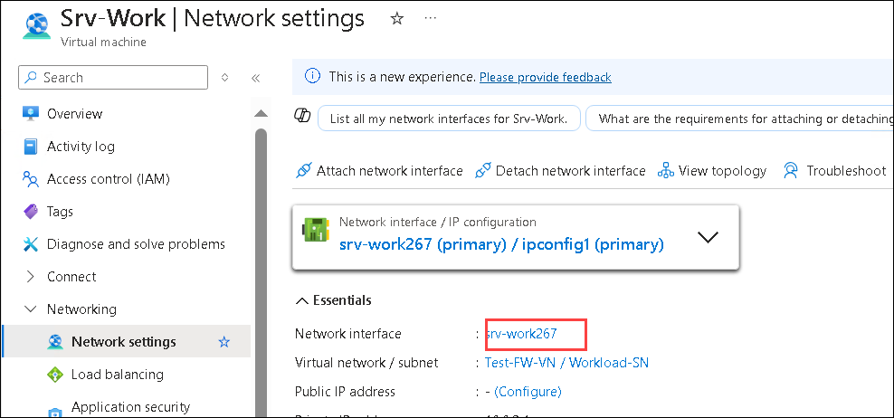  

1. On the network interface blade, in the **Settings** section, click **DNS servers (1)**, select the **Custom** option, add the two DNS servers referenced in the network rule: `209.244.0.3` and `209.244.0.4` **(2)**, and click **Save (3)** to save the change.

    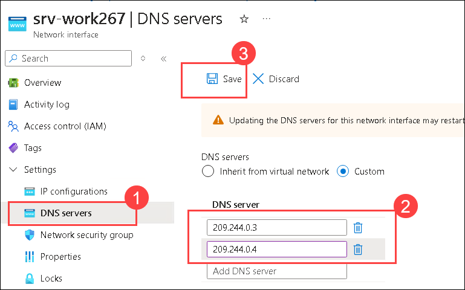  

1. Return to the **Srv-Work** virtual machine page.

    >**Note**: Wait for the update to complete.

    >**Note**: Updating the DNS servers for a network interface will automatically restart the virtual machine to which that interface is attached, and if applicable, any other virtual machines in the same availability set.

## Task 7: Test the firewall

In this task, you will test the firewall to confirm that it works as expected.

1. In the Azure portal, navigate back to the **AZ500LAB03** resource group.

1. On the **AZ500LAB03** blade, in the list of resources, click the **Srv-Jump** virtual machine.

    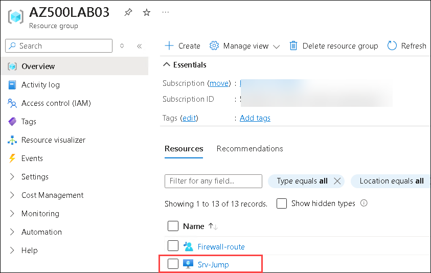  

1. On the **Srv-Jump** blade, click connect dropdown and select **Connect**. 

    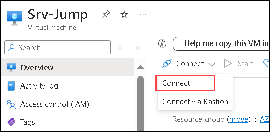  

1. Then on the **RDP** page, click **Download RDP File** and use it to connect to the **Srv-Jump** Azure VM via Remote Desktop.

      

1. If any warning popup prompts in browser for download, click on **Keep** .   

      

1. Click on **Open file**.

      

1. Click on **Connect**.

     

1. On the **Windows Security** pop up, click on **More choices.**

     

1. Select **Use a different account.**

     

1. When prompted to authenticate, provide the following credentials, after providing the credentials, click on **OK (3)**:

   |Setting|Value|
   |---|---|
   |User name|**localadmin (1)**|
   |Password|**Pa55w.rd1234 (2)**|

   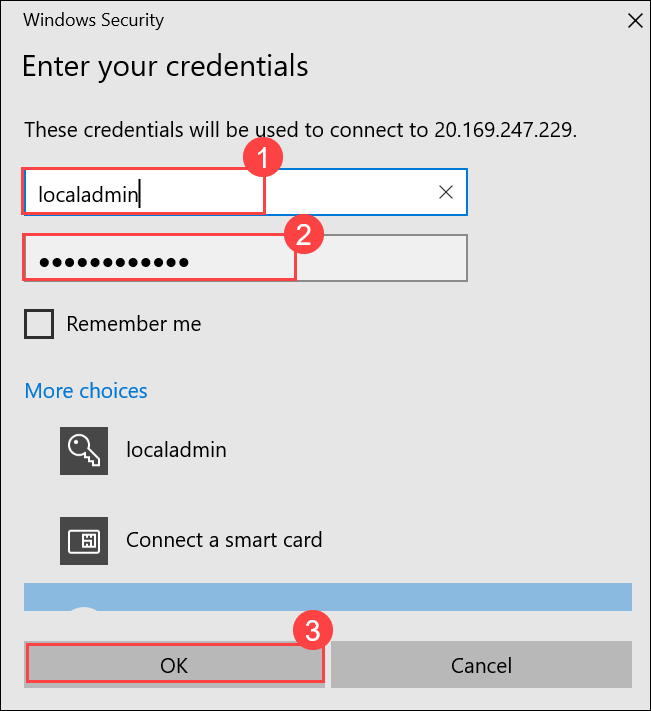  

1. Click on **Yes** to connect RDP.   

    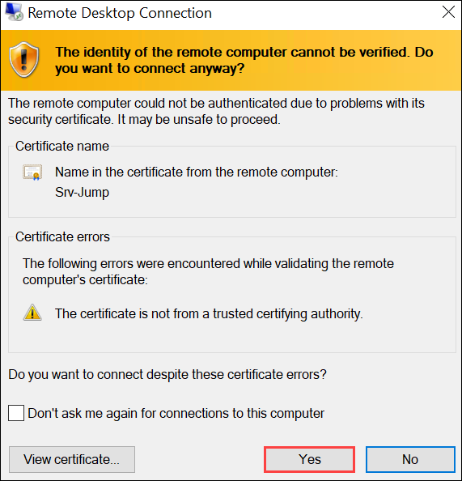  

    >**Note**: The following steps are performed in the Remote Desktop session to the **Srv-Jump** Azure VM. 

    >**Note**: You will connect to the **Srv-Work** virtual machine. This is being done so we can test the ability to access the bing.com website.  

1. Within the Remote Desktop session to **Srv-Jump**, right-click **Start**, in the right-click menu, click **Run**.

      

1. From the **Run** dialog box, run the following **(1)** to connect to **Srv-Work** and then click on **OK (2)** 

    ```
    mstsc /v:Srv-Work
    ```

    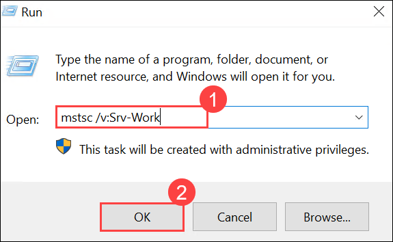  

1. When prompted to authenticate, provide the following credentials and then click on **OK (3)**.

   |Setting|Value|
   |---|---|
   |User name|**localadmin (1)**|
   |Password|**Pa55w.rd1234 (2)**|

   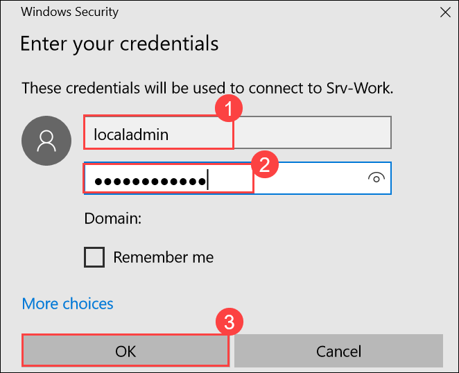  

    >**Note**: Wait for the Remote Desktop session to be established and the Server Manager interface to load.

1. Within the Remote Desktop session to **Srv-Work**, in **Server Manager**, click **Local Server (1)** and then click on **On (2)** corresponding to **IE Enhanced Security Configuration**.

      

1. In the **Internet Explorer Enhanced Security Configuration** dialog box, set both options to **Off (1)(2)** and click **OK (3)**.

      

1. Within the Remote Desktop session to **Srv-Work**, start Internet Explorer and browse to **`https://www.bing.com`**. 

    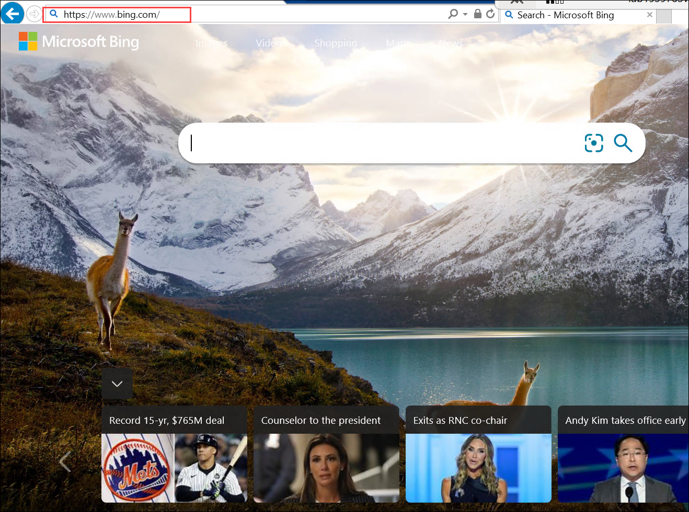  

    >**Note**: The website should successfully display. The firewall allows you access.

1. Browse to **`http://www.microsoft.com/`**

      

    >**Note**: Within the browser page, you should receive a message with text resembling the following: `Action: Deny. No rule matched. Proceeding with default action.` This is expected, since the firewall blocks access to this website. 

1. Terminate both Remote Desktop sessions.

> **Result:** You have successfully configured and tested the Azure Firewall.

> **Congratulations** on completing the task! Now, it's time to validate it. Here are the steps:
> - Hit the Validate button. If you receive a success message, you can proceed to the next task. 
> - If not, carefully read the error message and retry the step, following the instructions in the lab guide.
> - If you need any assistance, please contact us at labs-support@spektrasystems.com. We are available 24/7 to help you out.

<validation step="d7fc707d-6388-4dd1-80f2-5092ff0d75a8" />

### You have successfully completed the lab

