# Lab 07: Key Vault (Implementing Secure Data by setting up Always Encrypted)

## Lab scenario

You have been asked to create a proof of concept application that makes use of the Azure SQL Database support for Always Encrypted functionality. All of the secrets and keys used in this scenario should be stored in Key Vault. The application should be registered in Azure Active Directory (Azure AD) to enhance its security posture. To accomplish these objectives, the proof of concept should include:

- Creating an Azure Key Vault and storing keys and secrets in the vault.
- Create a SQL Database and encrypting content of columns in database tables by using Always Encrypted.

    >**Note**: For all the resources in this lab, we are using the **East US** region.

To keep the focus on the security aspects of Azure, related to building this proof of concept, you will start from an automated ARM template deployment, setting up a Virtual Machine with Visual Studio 2019 and SQL Server Management Studio 2019.

## Lab objectives

In this lab, you will complete the following exercises:

- Exercise 1: Deploy the base infrastructure from an ARM template
- Exercise 2: Configure the Key Vault resource with a key and a secret
- Exercise 3: Configure an Azure SQL database and a data-driven application
- Exercise 4: Demonstrate the use of Azure Key Vault in encrypting the Azure SQL database

## Estimated timing: 60 minutes

## Architecture Diagram

   

## Exercise 1: Deploy the base infrastructure from an ARM template

In this exercise, you will deploy infrastructure using an ARM template, configure Azure Key Vault with a key and a secret, set up an Azure SQL database with a connected data-driven application, and demonstrate database encryption using Azure Key Vault. These tasks will enhance your skills in automating deployments, managing secrets, and securing data in Azure.

### Task 1: Deploy an Azure VM and an Azure SQL database

In this task, you will deploy an Azure VM, which will automatically install Visual Studio 2019 and SQL Server Management Studio 2019 as part of the deployment.

1. In the Azure portal, in the **Search resources, services, and docs** text box at the top of the Azure portal page, type **Deploy a custom template** and press the **Enter** key.

1. On the **Custom deployment** blade, click the **Build your own template in the editor** option.

     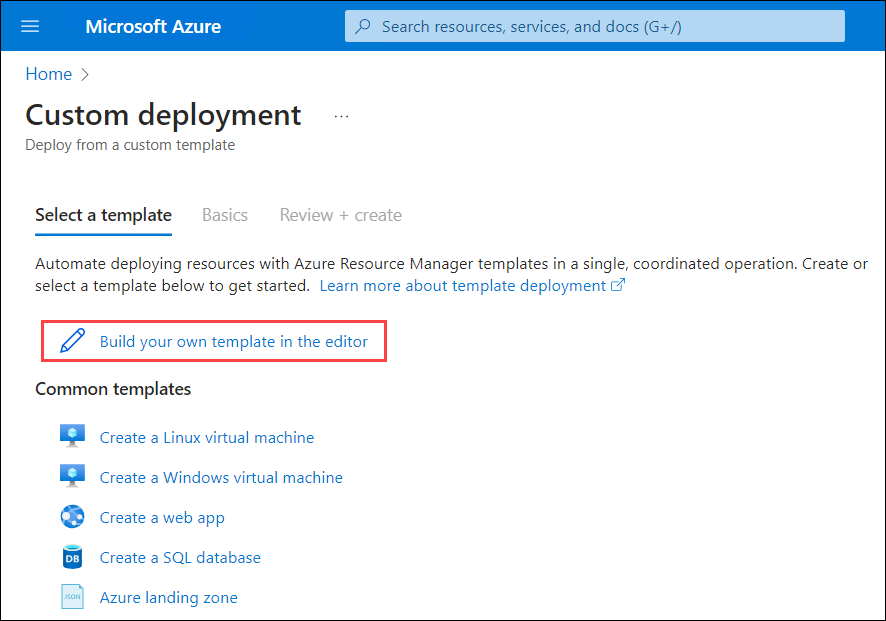

1. On the **Edit template** blade, click **Load file (1)**, locate the **C:\\AllFiles\\AZ500-AzureSecurityTechnologies-lab-files\\Allfiles\\Labs\\10\\az-500-10_azuredeploy.json (2)** file and click **Open**.

     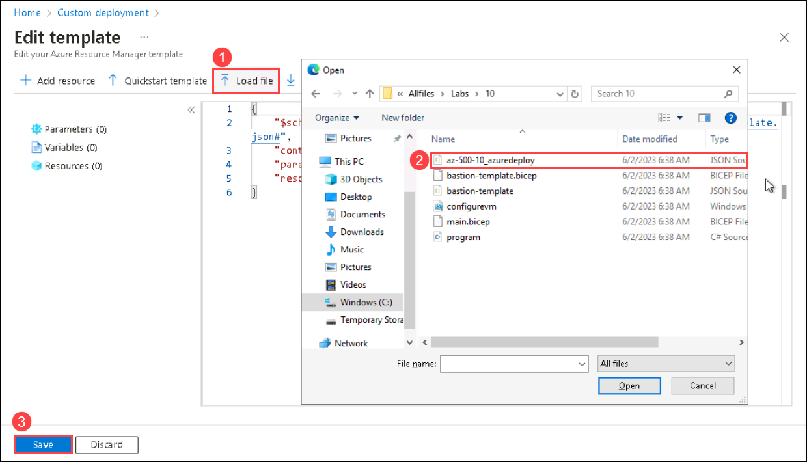

1. On the **Edit template** blade, click **Save (3)**.

1. On the **Custom deployment** blade, under **Deployment Scope** ensure that the following settings are configured (leave any others with their default values):

   |Setting|Value|
   |---|---|
   |Subscription|Let it be default|
   |Resource group|Select resource group with name **AZ500LAB07-<inject key="DeploymentID"></inject>**|
   |Location|**It will automatically fetch resource group location and set it for your deployment**|
   |Admin Username|**Student**|
   |Admin Password|**Pa55w.rd1234**|
   
    >**Note**: While you can change the administrative credentials used for logging on to the Virtual Machine, you don't have to.

    >**Note**: To identify Azure regions where you can provision Azure VMs, refer to [**https://azure.microsoft.com/en-us/regions/offers/**](https://azure.microsoft.com/en-us/regions/offers/)

1. Click the **Review + create** button, and confirm the deployment by clicking the **Create** button. 

    >**Note**: This initiates the deployment of the Azure VM and Azure SQL Database required for this lab. 

    >**Note**: Do not wait for the ARM template deployment to be completed, continue on to the next exercise. The deployment might take up to **20-25 minutes**. 

    > **Congratulations** on completing the task! Now, it's time to validate it. Here are the steps:
    > - Hit the Validate button for the corresponding task.If you receive a success message, you can proceed to the next task. 
    > - If not, carefully read the error message and retry the step, following the instructions in the lab guide.
    > - If you need any assistance, please contact us at labs-support@spektrasystems.com. We are available 24/7 to help you out.

   <validation step="0e72c8e7-5523-4e4b-90d8-d0a51f2fcd66" />

## Exercise 2: Configure the Key Vault resource with a key and a secret

>**Note**: For all the resources in this lab, we are using the **East US** region.

In this exercise, you will create and configure an Azure Key Vault, add a key to securely store encryption keys, and add a secret for managing sensitive information. These steps will help you understand how to securely manage keys and secrets in Azure.

### Task 1: Create and configure a Key Vault

In this task, you will create an Azure Key Vault resource. You will also configure the Azure Key Vault permissions.

1. Open the Cloud Shell by clicking the first icon (next to the search bar) at the top right of the Azure portal. If prompted, select **PowerShell**.

     

     

1. On getting started page, select the option **No storage account required (1)** and select the **Subscription (2)** provided. once subscription is selected, click on **Apply (3)**.

     

1. Ensure **PowerShell** is selected in the drop-down menu in the upper-left corner of the Cloud Shell pane.

1. In the PowerShell session within the Cloud Shell pane, run the following to create an Azure Key Vault in the resource group **AZ500LAB07-<inject key="DeploymentID" enableCopy="false"/>**. (If you chose another name for this lab's Resource Group out of Task 1, use that name for this task as well). The Key Vault name must be unique. Remember the name you have chosen. You will need it throughout this lab.

    ```powershell
   $kvName = 'az500kv' + $(Get-Random)

   $location = (Get-AzResourceGroup -ResourceGroupName 'AZ500LAB07-<inject key="DeploymentID" enableCopy="false"/>').Location

   New-AzKeyVault -VaultName $kvName -ResourceGroupName 'AZ500LAB07-<inject key="DeploymentID" enableCopy="false"/>' -Location $location -DisableRbacAuthorization
    ```
1. The output of the last command will display the vault name and the vault URI. The vault URI is in the format `https://<vault_name>.vault.azure.net/`

1. Close the Cloud Shell pane. 

1. In the Azure portal, in the **Search resources, services, and docs** text box at the top of the Azure portal page, type **Resource groups** and press the **Enter** key.

1. On the **Resource groups** blade, in the list of resource group, click the **AZ500LAB07-<inject key="DeploymentID" enableCopy="false"/>** entry.

1. On the Resource Group blade, click the entry representing the newly created Key Vault. 

     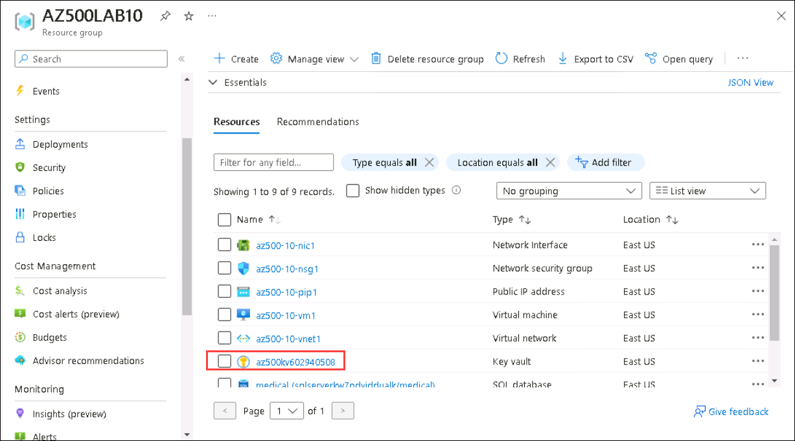

1. On the Key Vault blade, in the **Overview** section, click **Access Policies (1)** and then click **+ Create (2)**.

     

1. If the option of **Access Policies** is greyed out, navigate to the **Settings** tab on the left > select **Access configuration** > on the right side select **Vault access policies** and click on **Apply.**

     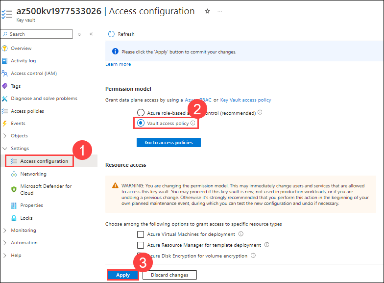

1. On the **Create an access policy** blade, specify the following settings (leave all others with their default values): 

    |Setting|Value|
    |----|----|
    |Configure from a template |**Key, Secret, & Certificate Management**|
    |Key permissions|click **Select all** permissions|
    |Key permissions/Cryptographic Operations|click **Sign** resulting in total of **1 selected** permissions|
    |Secret permissions|click **Select all** resulting in total of **7 selected** permissions|
    |Certification permissions|click **Select all** resulting in total of **15 selected** permissions and then click **Next**|
    |Under Principal tab|Search and select your user account 
     i.e. <inject key="AzureAdUserEmail" enableCopy="false"/>, on the **Principal** blade, and click **Next**|
    |Application (optional)|click **Next**|
    |Review + create|click **Create**|

    >**Note**: The previous Review + create operation returns to the Access policies page that lists Application, Email, Key Permissions, Secret Permissions, and Certificate Permissions.

### Task 2: Add a key to Key Vault

In this task, you will add a key to the Key Vault and view information about the key. 

1. In the Azure portal, open a PowerShell session in the Cloud Shell pane.

1. Ensure **PowerShell** is selected in the upper-left drop-down menu of the Cloud Shell pane.

1. In the PowerShell session within the Cloud Shell pane, run the following to add a software-protected key to the Key Vault: 
   
   ```powershell
   $kv = Get-AzKeyVault -ResourceGroupName 'AZ500LAB07-<inject key="DeploymentID" enableCopy="false"/>'

   $key = Add-AZKeyVaultKey -VaultName $kv.VaultName -Name 'MyLabKey' -Destination 'Software'
   ```

    >**Note**: The name of the key is **MyLabKey**

1. In the PowerShell session within the Cloud Shell pane, run the following to verify the key was created:
   
   ```powershell
   Get-AZKeyVaultKey -VaultName $kv.VaultName
   ```

1. In the PowerShell session within the Cloud Shell pane, run the following to display the key identifier:
   
   ```powershell
   $key.key.kid
   ```

1. Minimize the Cloud Shell pane. 

1. Back in the Azure portal, on the Key Vault blade, in the **Objects** section, click **Keys**.

1. In the list of keys, click the **MyLabKey** entry and then, on the **MyLabKey** blade, click the entry representing the current version of the key.

     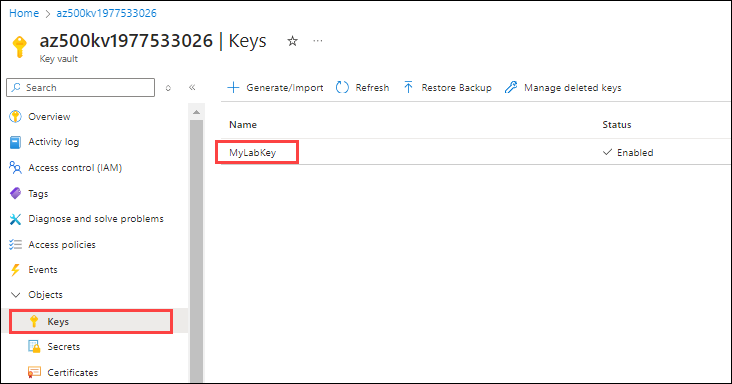

     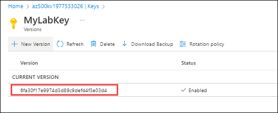

    >**Note**: Examine the information about the key you created.

    >**Note**: You can reference any key by using the key identifier. To get the most current version, reference `https://<key_vault_name>.vault.azure.net/keys/MyLabKey` or get the specific version with: `https://<key_vault_name>.vault.azure.net/keys/MyLabKey/<key_version>`

### Task 3: Add a Secret to Key Vault

1. Switch back to the Cloud Shell pane.

1. In the PowerShell session within the Cloud Shell pane, run the following to create a variable with a secure string value:
   
    ```powershell
    $secretvalue = ConvertTo-SecureString 'Pa55w.rd1234' -AsPlainText -Force
    ```
1.  In the PowerShell session within the Cloud Shell pane, run the following to add the secret to the vault:
   
    ```powershell
    $secret = Set-AZKeyVaultSecret -VaultName $kv.VaultName -Name 'SQLPassword' -SecretValue $secretvalue
    ```

    >**Note**: The name of the secret is SQLPassword. 

1.  In the PowerShell session within the Cloud Shell pane, run the following to verify the secret was created.
   
    ```powershell
    Get-AZKeyVaultSecret -VaultName $kv.VaultName
    ```

1. Minimize the Cloud Shell pane. 

1. In the Azure portal, navigate back to the Key Vault blade. In the **Objects** section, click **Secrets**.

1. In the list of secrets, click the **SQLPassword** entry and then, on the **SQLPassword** blade, click the entry representing the current version of the secret.

     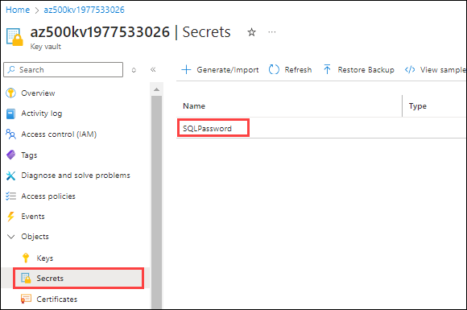

     

    >**Note**: Examine the information about the secret you created.

    >**Note**: To get the most current version of a secret, reference `https://<key_vault_name>.vault.azure.net/secrets/<secret_name>` or get a specific version, reference `https://<key_vault_name>.vault.azure.net/secrets/<secret_name>/<secret_version>`

    > **Congratulations** on completing the task! Now, it's time to validate it. Here are the steps:
    > - Hit the Validate button for the corresponding task.If you receive a success message, you can proceed to the next task. 
    > - If not, carefully read the error message and retry the step, following the instructions in the lab guide.
    > - If you need any assistance, please contact us at labs-support@spektrasystems.com. We are available 24/7 to help you out.

  <validation step="78d6ad92-713c-4103-9c46-2c825031ea9a" />

## Exercise 3: Configure an Azure SQL database and a data-driven application

In this exercise, you will enable a client application to access Azure SQL Database, create a Key Vault access policy, retrieve the ADO.NET connection string, and log into an Azure VM running Visual Studio and SQL Management Studio. You will then create a SQL Database table and encrypt selected columns, ensuring secure access and data protection.

### Task 1: Enable a client application to access the Azure SQL Database service. 

In this task, you will enable a client application to access the Azure SQL Database service. This will be done by setting up the required authentication and acquiring the Application ID and Secret that you will need to authenticate your application.

1. In the Azure portal, in the **Search resources, services, and docs** text box at the top of the Azure portal page, type **App Registrations** and press the **Enter** key.

1. On the **App Registrations** blade, click **+ New registration**. 
	
     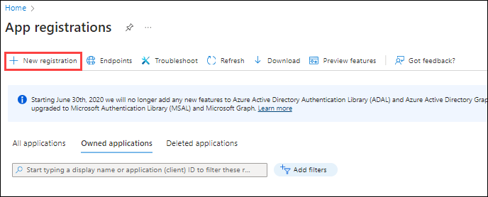
	
1. On the **Register an application** blade, specify the following settings (leave all others with their default values):

    |Setting|Value|
    |----|----|
    |Name|**sqlApp**|
    |Redirect URI (optional)|**Web** and **https://sqlapp**|

     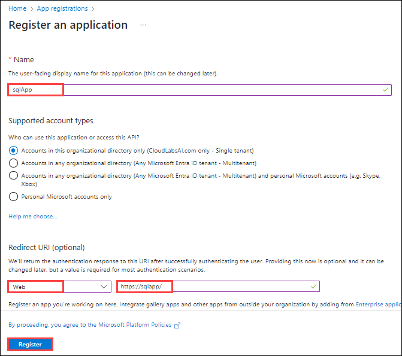

1.  On the **Register an application** blade, click **Register**. 

    >**Note**: Once the registration is completed, the browser will automatically redirect you to **sqlApp** blade. 

1. On the **sqlApp** blade, identify the value of **Application (client) ID**. 

    >**Note**: Record this value. You will need it in the next task.

1. On the **sqlApp** blade, in the **Manage** section, click **Certificates & secrets** under Manage.

1. On the **sqlApp | Certificates & secrets** blade / **Client Secrets** section, click **+ New client secret**
	
     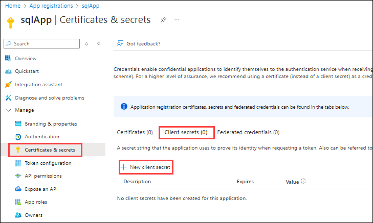
	
1. In the **Add a client secret** pane, specify the following settings:

    |Setting|Value|
    |----|----|
    |Description|**Key1**|
    |Expires|Select **365 days (12 months)**|

     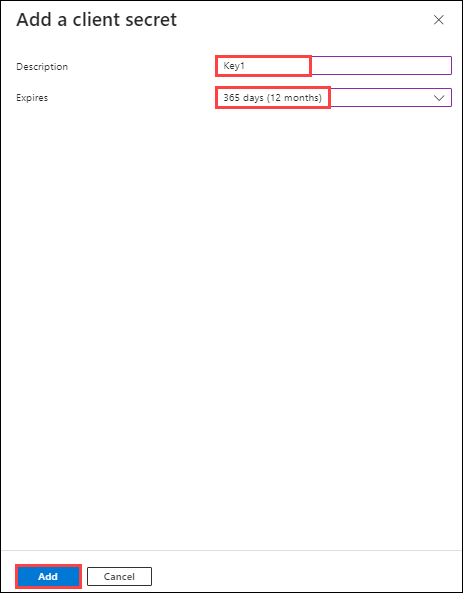
	
1. Click **Add** to update the application credentials.

1. On the **sqlApp | Certificates & secrets** blade, identify the value of **Key1**.

    >**Note**: Record this value. You will need it in the next task. 

    >**Note**: Make sure to copy the value *before* you navigate away from the blade. Once you do, it is no longer possible to retrieve its clear text value.

### Task 2: Create a policy allowing the application access to the Key Vault.

In this task, you will grant the newly registered app permissions to access secrets stored in the Key Vault.

1. In the Azure portal, open a PowerShell session in the Cloud Shell pane.

1. Ensure **PowerShell** is selected in the upper-left drop-down menu of the Cloud Shell pane.

1. In the PowerShell session within the Cloud Shell pane, run the following to create a variable storing the **Application (client) ID** you recorded in the previous task (replace the `<Azure_AD_Application_ID>` placeholder with the value of the **Application (client) ID**):
   
    ```powershell
    $applicationId = '<Azure_AD_Application_ID>'
    ```
1. In the PowerShell session within the Cloud Shell pane, run the following to create a variable storing the Key Vault name.

    ```powershell
    $kvName = (Get-AzKeyVault -ResourceGroupName 'AZ500LAB07-<inject key="DeploymentID" enableCopy="false"/>').VaultName

    $kvName
    ```

1. In the PowerShell session within the Cloud Shell pane, run the following to grant permissions on the Key Vault to the application you registered in the previous task:

    ```powershell
    Set-AZKeyVaultAccessPolicy -VaultName $kvName -ResourceGroupName AZ500LAB07-<inject key="DeploymentID" enableCopy="false"/> -ServicePrincipalName $applicationId -PermissionsToKeys get,wrapKey,unwrapKey,sign,verify,list
    ```
1. Close the Cloud Shell pane. 

### Task 3: Retrieve SQL Azure database ADO.NET Connection String 

The ARM-template deployment in Exercise 1 provisioned an Azure SQL Server instance and an Azure SQL database named **medical**. You will update the empty database resource with a new table structure and select data columns for encryption

1. In the Azure portal, in the **Search resources, services, and docs** text box at the top of the Azure portal page, type **SQL databases** and press the **Enter** key.

1. In the list of SQL databases, click the **medical(<randomsqlservername>)** entry.

    >**Note**: If the database cannot be found, this likely means the deployment you initiated in Exercise 1 has not completed yet. You can validate this by browsing to the Azure Resource Group "AZ500LAB07" (or the name you chose), and selecting **Deployments** from the Settings pane.  

1. On the SQL database blade, in the **Settings** section, click **Connection strings**. 

    >**Note**: The interface includes connection strings for ADO.NET, JDBC, ODBC, PHP, and Go. 
   
1. Record the **ADO.NET (SQL authentication)** connection string. You will need it later.
	
     
	
    >**Note**: When you use the connection string, make sure to replace the `{your_password}` placeholder with **Pa55w.rd1234**.

### Task 4: Log on to the Azure VM running Visual Studio 2019 and SQL Management Studio 2019

In this task, you log on to the Azure VM, which deployment you initiated in Exercise 1. This Azure VM hosts Visual Studio 2019 and SQL Server Management Studio 2019.

>**Note**: Before you proceed with this task, ensure that the deployment you initiated in the first exercise has completed successfully. You can validate this by navigating to the blade of the Azure resource group "Az500Lab07" and selecting **Deployments** from the Settings pane.  

1. In the Azure portal, in the **Search resources, services, and docs** text box at the top of the Azure portal page, type **virtual machines** and press the **Enter** key.

1. In the list of Virtual Machines shown, select the **az500-10-vm1** entry. On the **az500-10-vm1** blade, on the **Essentials** pane, take note of the **Public IP address**. You will use this later. 

     
	
### Task 5: Create a table in the SQL Database and select data columns for encryption

In this task, you will connect to the SQL Database with SQL Server Management Studio and create a table. You will then encrypt two data columns using an autogenerated key from the Azure Key Vault. 

1. In the Azure portal, navigate to the blade of the **medical** SQL database, in the **Essentials** section, identify the server name, and then, in the toolbar, click **Set server firewall**.  

    >**Note**: Record the server name. You will need the server name later in this task.
	
	
	
1. On the **Networking** blade, scroll down to **Firewall Rules**, click on **+Add a firewall rule (1)**, and specify the following settings and click **OK (3)**: 
	
	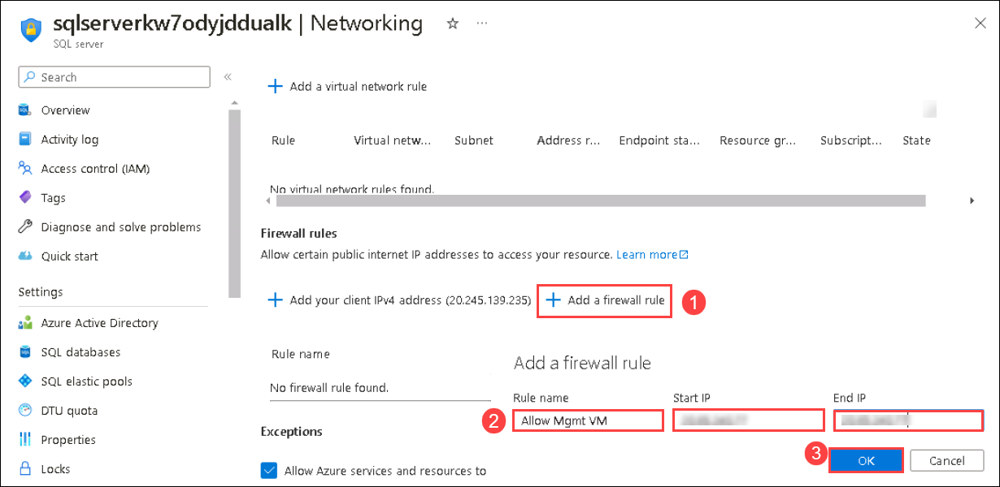
	
    |Setting|Value|
    |---|---|
    |Rule Name|**Allow Mgmt VM (2)**|
    |Start IP|Enter the Public IP Address of the az500-10-vm1|
    |End IP|Enter the Public IP Address of the az500-10-vm1|

1. Click **Save** to save the change and close the confirmation pane. 

    >**Note**: This modifies the server firewall settings, allowing connections to the medical database from the Azure VM's public IP address you deployed in this lab.

1. Navigate back to the **az500-10-vm1** blade, click **Overview**, next click **Connect** and, in the drop-down menu, click **Connect**.
	
1. Click **Download RDP File** under Native RDP tab and use it to connect to the **az500-10-vm1** Azure VM via Remote Desktop. Select **Keep** to download the RDP file. Open the RDP file and select **Connect**. When prompted to authenticate, provide the following credentials and click **Ok**. In the pop that follows, click on **Yes**.
	
	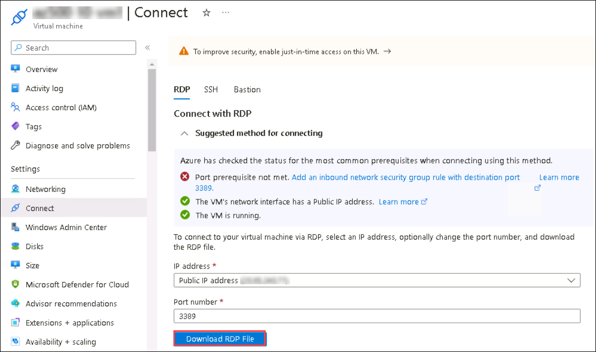
	
    |Setting|Value|
    |---|---|
    |User name|**Student**|
    |Password|**Pa55w.rd1234**|

    >**Note**: Wait for the Remote Desktop session and **Server Manager** to load. Close Server Manager. 

    >**Note**: The remaining steps in this lab are performed within the Remote Desktop session to the **az500-10-vm1** Azure VM. 

1. Click **Start**, in the **Start** menu, expand the **Microsoft SQL Server Tools 20** folder, and click the **SQL Server Management Studio 20** menu item.

1. In the **Connect to Server** dialog box, specify the following settings: 

    |Setting|Value|
    |---|---|
    |Server Type|**Database Engine**|
    |Server Name|the server name you identified earlier in this task|
    |Authentication|**SQL Server Authentication**|
    |Login|**Student**|
    |Password|**Pa55w.rd1234**|

	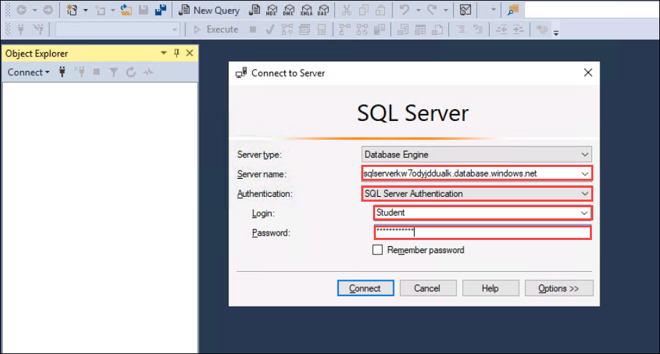
	
1. In the **Connect to Server** dialog box, click **Connect**.

1. Within the **SQL Server Management Studio** console, in the **Object Explorer** pane, expand the **Databases** folder.

1. In the **Object Explorer** pane, right-click the **medical** database and click **New Query**.
	
	
	
1. Paste the following code into the query window and click **Execute**. This will create a **Patients** table.

     ```sql
     CREATE TABLE [dbo].[Patients](
		[PatientId] [int] IDENTITY(1,1),
		[SSN] [char](11) NOT NULL,
		[FirstName] [nvarchar](50) NULL,
		[LastName] [nvarchar](50) NULL,
		[MiddleName] [nvarchar](50) NULL,
		[StreetAddress] [nvarchar](50) NULL,
		[City] [nvarchar](50) NULL,
		[ZipCode] [char](5) NULL,
		[State] [char](2) NULL,
		[BirthDate] [date] NOT NULL 
     PRIMARY KEY CLUSTERED ([PatientId] ASC) ON [PRIMARY] );
     ```
1. After the table is created successfully, in the **Object Explorer** pane, expand the **medical** database node. Now expand the **Tables** node and right-click the **dbo.Patients** node, and click **Encrypt Columns**. 

    >**Note**: This will initiate the **Always Encrypted** wizard.

1. On the **Introduction** page, click **Next** twice.

1. On the **Column Selection** page, select the **SSN** and **Birthdate** columns, set the **Encryption Type** of the **SSN** column to **Deterministic** and of the **Birthdate** column to **Randomized**, and click **Next**.
	
    >**Note**: While performing the encryption if any error thrown like **Exception has been thrown by the target of an innvocation** related to **Rotary(Microsoft.SQLServer.Management.ServiceManagement)** then make sure the **Key Permission's** values of **Rotation Policy Operations** are **unchecked**, if not in the Azure portal navigate to the **Key Vault** >> **Access Policies** >> **Key Permissions** >> Uncheck all the values under the **Rotation Policy Operations** >> Under **Privileged Key Operations** >> Uncheck **Release**.	

1. On the **Master Key Configuration** page, select **Azure Key Vault**, click **Sign in**. When prompted, authenticate by using the same user account you used to provision the Azure Key Vault instance earlier in this lab, ensure that Key Vault appears in the **Select an Azure Key Vault** drop-down list, and click **Next**.

1. On the **Run Settings** page, click **Next**.
	
1. On the **Summary** page, click **Finish** to proceed with the encryption. When prompted, sign in again by using the same user account you used to provision the Azure Key Vault instance earlier in this lab.

1. Once the encryption process is complete, on the **Results** page, click **Close**.
	
    >**Note**: Process may take upto 5 minutes.

1. In the **SQL Server Management Studio** console, in the **Object Explorer** pane, under the **medical** node, expand the **Security** and **Always Encrypted Keys** subnodes. 

    >**Note**: The **Always Encrypted Keys** subnode contains the **Column Master Keys** and **Column Encryption Keys** subfolders.

## Exercise 4: Demonstrate the use of Azure Key Vault in encrypting the Azure SQL database

In this exercise, you will run a data-driven application to demonstrate how Azure Key Vault is used for encrypting an Azure SQL database, showcasing how to securely manage encryption keys for protecting data at rest.

### Task 1: Run a data-driven application to demonstrate the use of Azure Key Vault in encrypting the Azure SQL database

You will create a Console application using Visual Studio to load data into the encrypted columns and then access that data securely using a connection string that accesses the key in the Key Vault.

1. From the RDP session to the **az500-10-vm1**, launch **Visual Studio 2019** from the **Start menu**.

1. Switch to the window displaying Visual Studio 2019 welcome message, click the **Sign in** button and, when prompted, provide the credentials you used to authenticate to the Azure subscription you are using in this lab. Now click **Start Visual studio**.

1. On the **Get started** page, click **Create a new project**. 

1. In the list of project templates, search for **Console App (.NET Framework)**, in the list of results, click **Console App (.NET Framework)** for **C#**, and click **Next**.
	
     
	
1. On the **Configure your new project** page, specify the following settings (leave other settings with their default values) and click on **Create**.

    |Setting|Value|
    |---|---|
    |Project name|**OpsEncrypt**|
    |Solution name|**OpsEncrypt**|
    |Framework|**.NET Framework 4.7.2**|
	
1. In the Visual Studio console, click the **Tools** menu, in the drop-down menu, click **NuGet Package Manager**, and, in the cascading menu, click **Package Manager Console**.

1. In the **Package Manager Console** pane, run the following to install the first required **NuGet** package:

    ```powershell
    Install-Package Microsoft.SqlServer.Management.AlwaysEncrypted.AzureKeyVaultProvider
    ```

1. In the **Package Manager Console** pane, run the following to install the second required **NuGet** package:

    ```powershell
    Install-Package Microsoft.IdentityModel.Clients.ActiveDirectory
    ```
	
1. Minimize the RDP session to your Azure virtual machine. In Labvm Server then navigate to **C:\AllFiles\AZ500-AzureSecurityTechnologies-lab-files\Allfiles\Labs\10\program.cs**, open it in Notepad, and copy its content into Clipboard.

1. Return to the RDP session, and in the Visual Studio console, in the **Solution Explorer** window, click **Program.cs** and replace its content with the code you copied into Clipboard.
	
1. In the Visual Studio window, in the **Program.cs** pane, in line 15, replace the `<connection string noted earlier>` placeholder with the Azure SQL database **ADO.NET** connection string you recorded earlier in the lab. In the connection string, replace the `{your_password}` placeholder, with `Pa55w.rd1234`. If you saved the string on the lab computer, you may need to leave the RDP session to copy the ADO string, then return to the Azure virtual machine to paste it in.

1. In the Visual Studio window, in the **Program.cs** pane, in line 16, replace the `<client id noted earlier>` placeholder with the value of **Application (client) ID** of the registered app you recorded earlier in the lab. 

1. In the Visual Studio window, in the **Program.cs** pane, in line 17, replace the `<key value noted earlier>` placeholder with the value of **Key1** of the registered app you recorded earlier in the lab. 

1. In the Visual Studio console, click the **Start** button to initiate the build of the console application and start it.

1. The application will start a Command Prompt window. When prompted for password, type **Pa55w.rd1234** to connect to Azure SQL Database. 

1. Leave the console app running and switch to the **SQL Management Studio** console. 

1. In the **Object Explorer** pane, right-click the **medical** database and, in the right-click menu, click **New Query**.

1. From the query window, run the following query by clicking on **Execute** to verify that the data loaded into the database from the console app is encrypted.

    ```sql
    SELECT FirstName, LastName, SSN, BirthDate FROM Patients;
    ```

1. Switch back to the console application where you are prompted to enter a valid SSN. This will query the encrypted column for the data. At the Command Prompt, type the following and press the Enter key:

    ```cmd
    999-99-0003
    ```

    >**Note**: Verify that the data returned by the query is not encrypted.

1. To terminate the console app, press the Enter key.
	
> **Congratulations** on completing the task! Now, it's time to validate it. Here are the steps:
> - Hit the Validate button. If you receive a success message, you can proceed to the next task. 
> - If not, carefully read the error message and retry the step, following the instructions in the lab guide.
> - If you need any assistance, please contact us at labs-support@spektrasystems.com. We are available 24/7 to help you out.

   <validation step="9c0b0cd9-dab4-4395-a98a-0a4dbf1e8444" />

### You have successfully completed the lab
	

