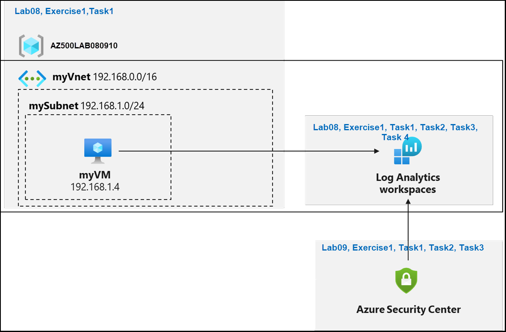
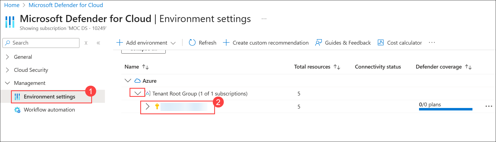
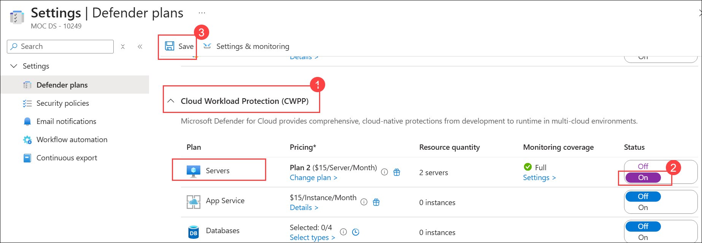
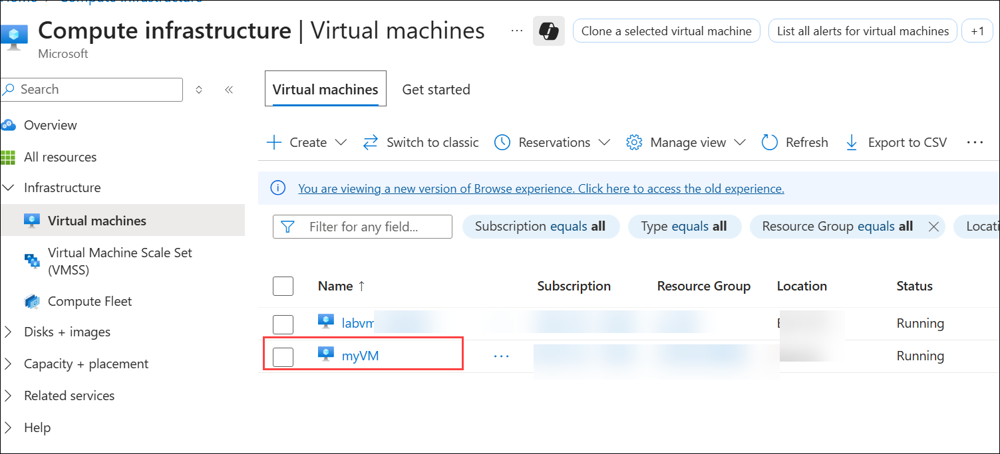
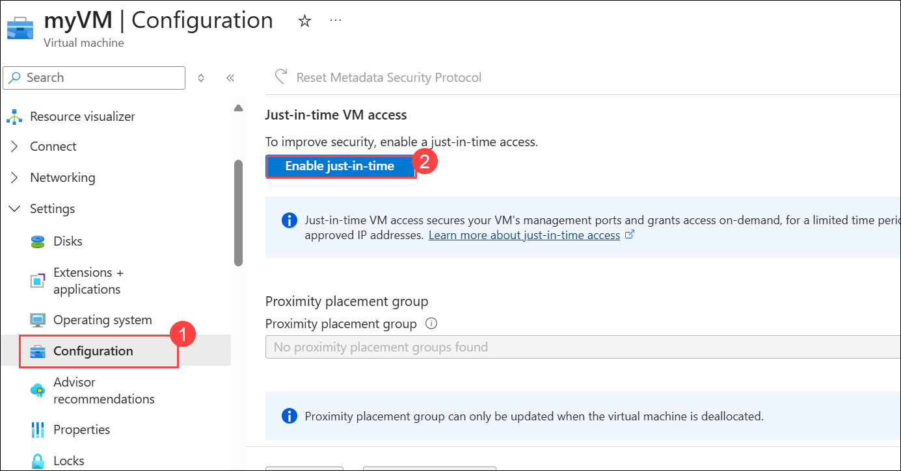
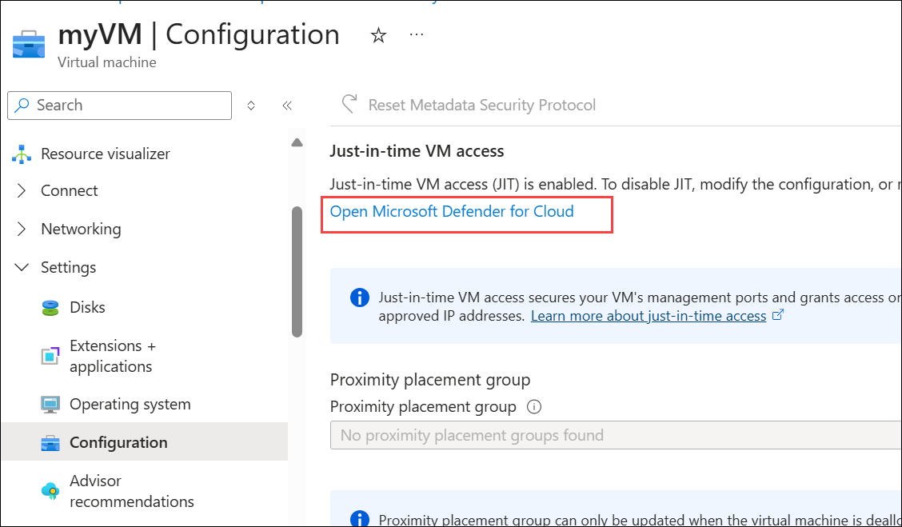
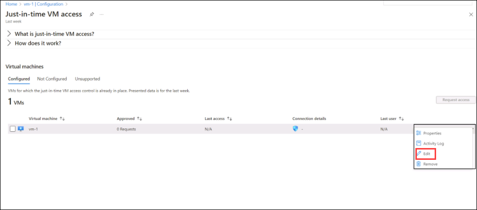

# Lab 09: Configuring Microsoft Defender for Cloud Enhanced Security Features for Servers

## Lab scenario

You have been asked to create a proof of concept of Microsoft Defender for Cloud-based environment. Specifically, you want to:

- Configure Microsoft Defender for Cloud to monitor a virtual machine.
- Review Microsoft Defender for Cloud recommendations for the virtual machine.
- Implement recommendations for guest configuration and Just in time VM access. 
- Review how the Secure Score can be used to determine progress toward creating a more secure infrastructure.

 > For all the resources in this lab, we are using the **East US** region.

## Lab objectives

In this lab, you will complete the following exercise:

- Exercise 1: Implement Microsoft Defender for Cloud

## Architecture Diagram

 

## Exercise 1: Implement Microsoft Defender for Cloud

In this exercise, you will complete the following tasks:

- Task 1: Configure Microsoft Defender for Cloud
- Task 2: Review the Microsoft Defender for Cloud recommendations
- Task 3: Implement the Microsoft Defender for Cloud recommendation to enable Just in time VM Access

### Task 1: Configure Microsoft Defender for Cloud

In this task, you will on-board and configure Microsoft Defender for Cloud.

1. In the Azure portal, in the **Search resources, services, and docs** text box at the top of the Azure portal page, type **Microsoft Defender for Cloud** and press the **Enter** key.

1. On the **Microsoft Defender for Cloud | Overview** blade, in the vertical menu on the left side, in the **Management** section, click **Environment Settings (1)**. 

   >**Note**: If you get any pop-up you can click on **Maybe Later**

    - Expand the environment settings folders until the subscription section is displayed, then click the **subscription** to view details **(2)**.

       

1. On the **Settings | Azure Defender plans** blade, under Defender plans, expand **Cloud Workload Protection (CWP) (1)**.

1. From the **Cloud Workload Protection (CWP)** Plan list, select **Servers**. On the right side of the page, change the Status from Off to **On (2)**, then click **Save (4)**.
   
     

## Task 2: Implement the Microsoft Defender for Cloud recommendation to enable Just in time VM Access

In this task, you will implement the Microsoft Defender for Cloud recommendation to enable Just in time VM Access on the virtual machine.

1. In the search box at the top of the portal, enter **virtual machines**. Select **Virtual machines** in the search results.

1. Select **myVM**.

   

1. Select **Configuration (1)**from the Settings section of **myVM**. Under Just-in-time VM access, select **Enable just-in-time (2)**.

   

1. Under Just-in-time VM access, click on the link that reads **Open Microsoft Defender for Cloud**.

   

1. By default, just-in-time access for the VM uses these settings:

   - Windows machines
   
     - RDP port: 3389
     - Maximum allowed access: Three hours
     - Allowed source IP addresses: Any

   - Linux machines
     - SSH port: 22
     - Maximum allowed access: Three hours
     - Allowed source IP addresses: Any
        
1. By default, just-in-time access for the VM uses these settings:

   - From the **Configured** tab, right-click on the VM to which you want to add a port, and select **edit**.

        

   - Under **JIT VM access configuration,** you can either edit the existing settings of an already protected port or add a new custom port.
   - When you've finished editing the ports, select **Save.**   

### Task 3: Request access to a JIT-enabled VM from the Azure virtual machine's connect page.

>**Note**: When a VM has a JIT enabled, you have to request access to connect to it. You can request access in any of the supported ways, regardless of how you enabled JIT.
   
1. In the Azure portal, open the virtual machines pages.

2. Select the VM to which you want to connect, and open the **Connect** page.

   - Azure checks to see if JIT is enabled on that VM.

        - If JIT isn't enabled for the VM, you're prompted to enable it.
    
        - If JIT is enabled, select **Request access** to pass an access request with the requesting IP, time range, and ports that were configured for that VM.
    

> **Congratulations** on completing the task! Now, it's time to validate it. Here are the steps:
   - If you receive a success message, you can proceed to the next task.
   - If not, carefully read the error message and retry the step, following the instructions in the lab guide.
   - If you need any assistance, please contact us at cloudlabs-support@spektrasystems.com. We are available 24/7 to help you out.
 
   <validation step="b6cace8a-4562-4975-863b-5feceb7b1a70" />
 
### You have successfully completed the lab, click on Next to start the next lab
