# Lab 10: Microsoft Sentinel

## Lab scenario
You have been asked to create a proof of concept of Microsoft Sentinel-based threat detection and response. Specifically, you want to:

- Start collecting data from Azure Activity and Security Center.
- Add built in and custom alerts 
- Review how Playbooks can be used to automate a response to an incident.

> For all the resources in this lab, we are using the **East US** region.

## Lab objectives

In this lab, you will complete the following exercise:

- **Exercise 1:** Implement Microsoft Sentinel

## Estimated timing: 30 Minutes

## Architecture Diagram

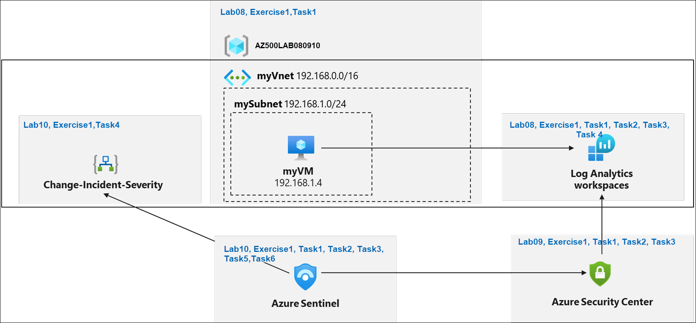

# Exercise 1: Implement Microsoft Sentinel

In this exercise, you will complete the following tasks:

- Task 1: On-board Microsoft Sentinel
- Task 2: Connect Azure Activity to Sentinel
- Task 3: Create a rule that uses the Azure Activity data connector. 
- Task 4: Create a playbook
- Task 5: Create a custom alert and configure the playbook as an automated response.
- Task 6: Invoke an incident and review the associated actions.

## Task 1: On-board Microsoft Sentinel

In this task, you will on-board Microsoft Sentinel and connect the Log Analytics workspace. 

1. In the Azure portal, in the **Search resources, services, and docs** text box at the top of the Azure portal page, type **Microsoft Sentinel (1)** and select **Microsoft Sentinel (2)** from Services.

   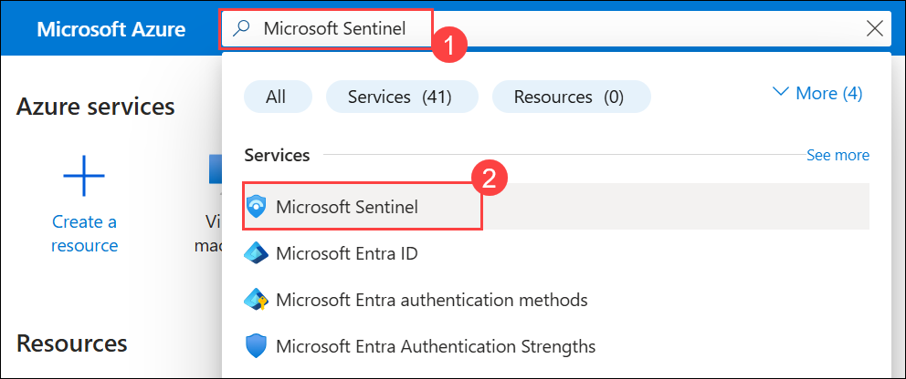 
	
1. On the **Microsoft Sentinel** blade, click **+ Create**.	

     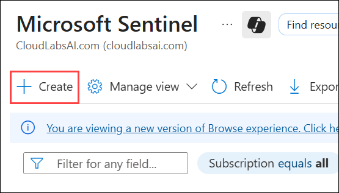 

1. On the **Add Microsoft Sentinel to a workspace** blade, select the Log Analytics workspace you created in the Azure Monitor lab  **(1)** and click **Add (2)**.

    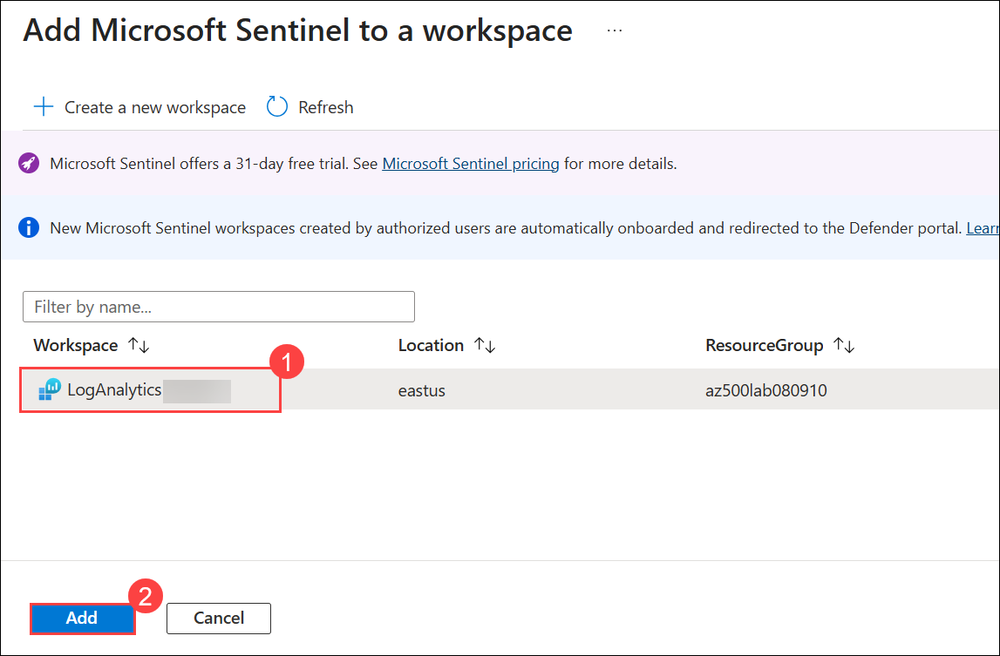 

    >**Note**: Microsoft Sentinel has very specific requirements for workspaces. For example, workspaces created by Azure Security Center can not be used. Read more at [Quickstart: On-board Azure Sentinel](https://docs.microsoft.com/en-us/azure/sentinel/quickstart-onboard)
	
## Task 2: Configure Microsoft Sentinel to use the Azure Activity data connector. 

In this task, you will configure Sentinel to use the Azure Activity data connector.

1. Navigate to https://security.microsoft.com. In the **Microsoft Defender** portal, expand **Content management (2)** under the **Microsoft Sentinel (1)** section, and then click **Content hub (3)**.

     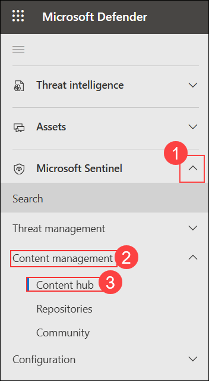

1. On the Content hub page, search for **Azure Activity (1)**, select **Azure Activity (2)** from the results, and then click **Install (3)** to add the solution.

    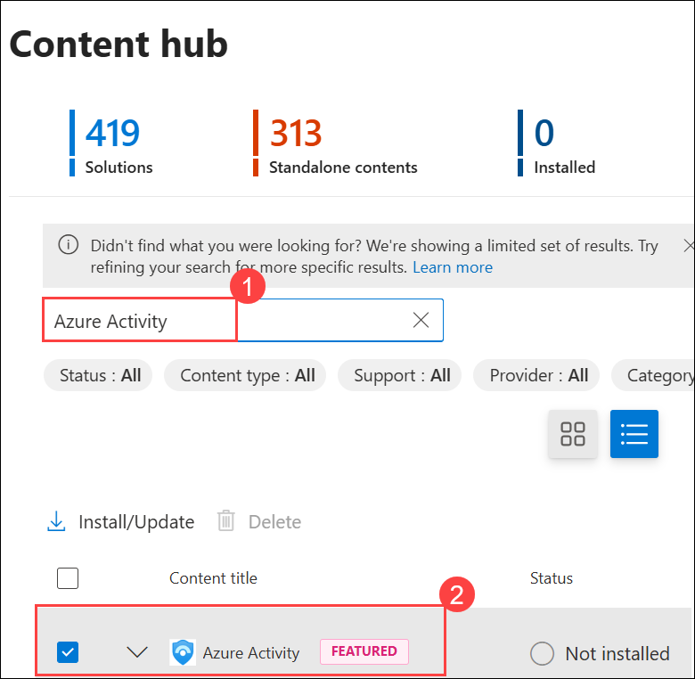

    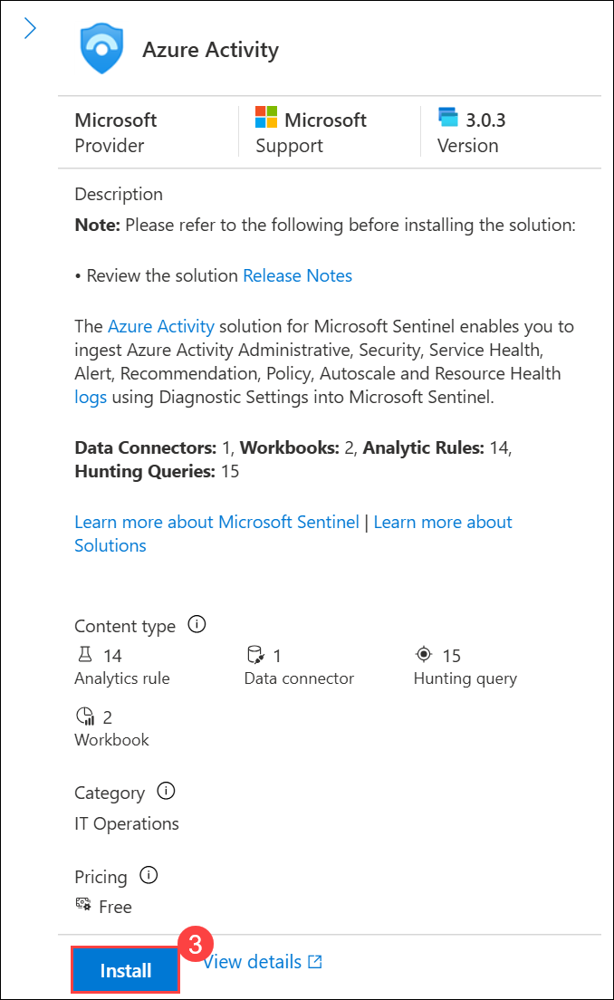

1. On the left navigation pane, expand **Configuration (1)**, select **Data connectors (2)**, and in the search bar, type **Azure Activity (3)**. From the results, select **Azure Activity (4)**. 

1. On the **Azure Activity** page, click **Open connector page (5)**.

   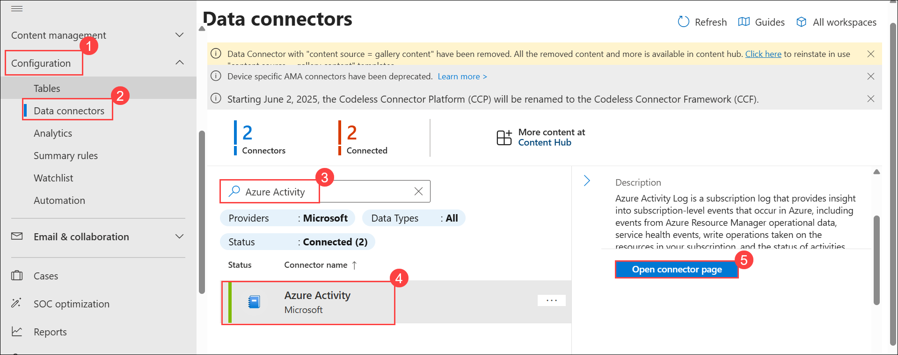 

1. On the **Azure Activity** blade the **Instructions** tab should be selected, note the **Prerequisites** and scroll down to the **Configuration**. Take note of the information describing the connector update. Your Azure Pass subscription never used the legacy connection method so you can skip step 1 (the **Disconnect All** button will be grayed out) and proceed to step 2.

1. In step 2 **Connect your subscriptions through diagnostic settings new pipeline**, review the "Launch the Azure Policy Assignment wizard and follow the steps" instructions then click **Launch the Azure Policy Assignment wizard\>**, It will navigate to azure.

    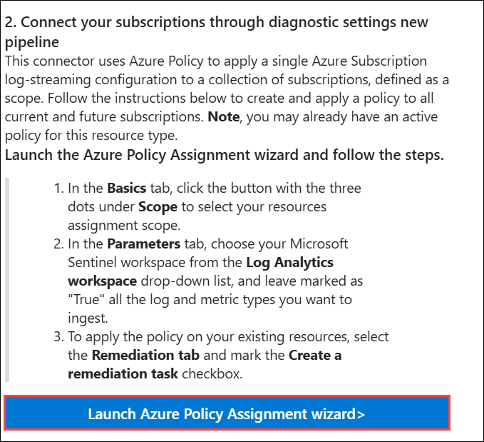 

1. On the **Configure Azure Activity logs to stream to specified Log Analytics workspace** (Assign Policy page) **Basics** tab, click the **Scope ellipsis (...) (1)** button. In the **Scope** page choose your subscription from the drop-down subscription list **(2)** and click the **Select (3)** button at the bottom of the page.

    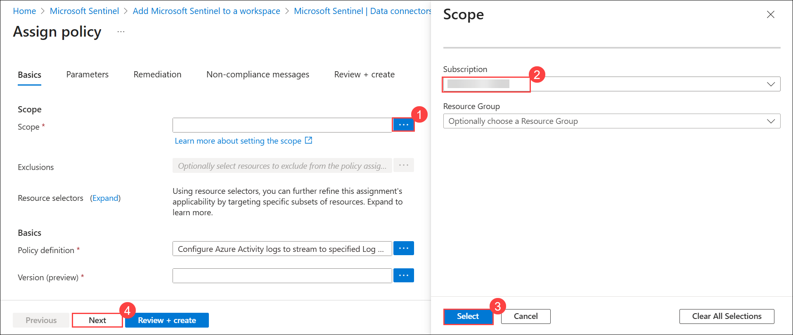 

    >**Note**: **Do not** select a Resource Group

1. Click the **Next (4)** button at the bottom of the **Basics** tab and proceed to the **Parameters** tab. On the **Parameters** tab click the **Primary Log Analytics workspace ellipsis (...) (1)** button. In the **Primary Log Analytics workspace** page, make sure your Azure pass subscription is selected **(2)** and use the **workspaces** drop-down to select the Log Analytics workspace you are using for Sentinel **(3)**. When done click the **Select (4)** button at the bottom of the page.

    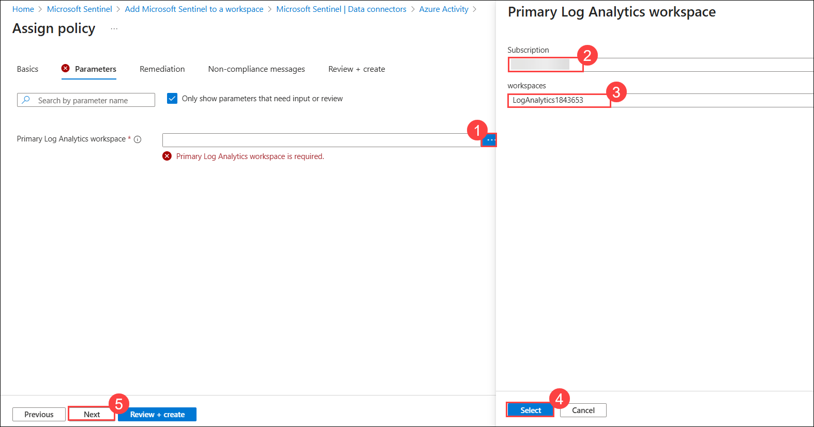 

1. Click the **Next (5)** button at the bottom of the **Parameters** tab to proceed to the **Remediation** tab. On the **Remediation** tab select the **Create a remediation task (1)** checkbox. This will enable the "Configure Azure Activity logs to stream to specified Log Analytics workspace" in the **Policy to remediate** drop-down. In the **System assigned identity location** drop-down, select the region (East US for example) **(2)** you selected earlier for your Log Analytics workspace.

    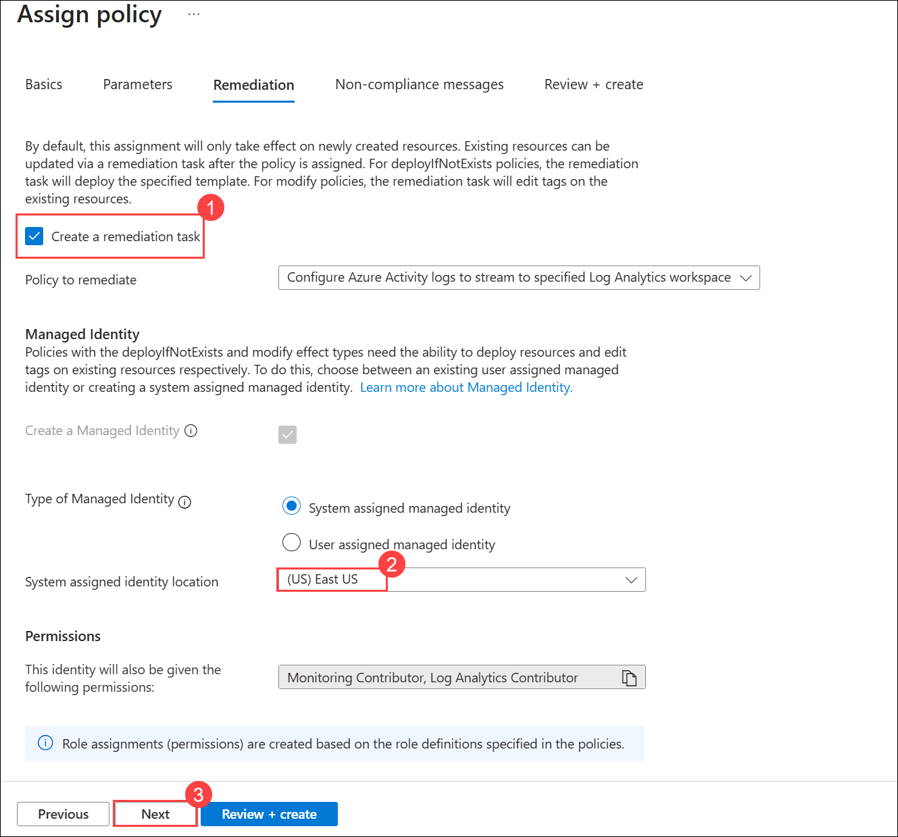 

1. Click the **Next (3)** button at the bottom of the **Remediation** tab to proceed to the **Non-compliance message** tab.  Enter a Non-compliance message if you wish (this is optional) and click the **Review + Create** button at the bottom of the  **Non-compliance message** tab.

    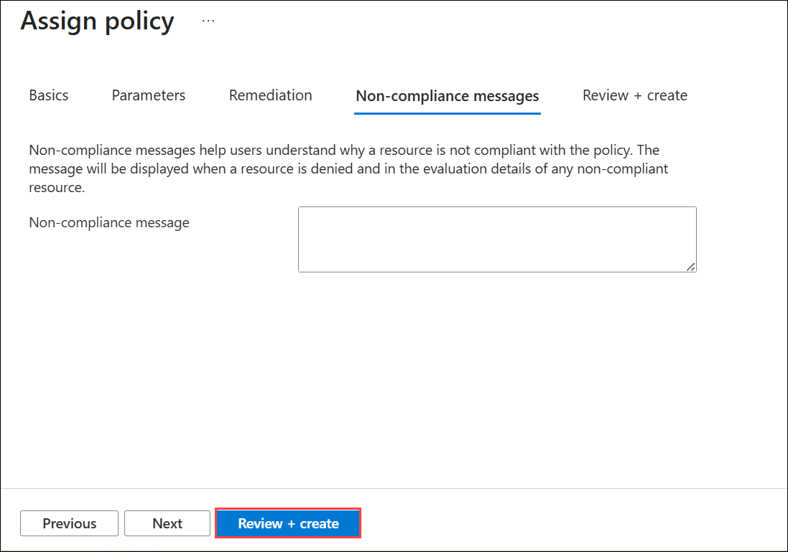 

1. Click the **Create** button. You should observe three succeeded status messages: **Creating policy assignment succeeded, Role Assignments creation succeeded, and Remediation task creation succeeded**.

    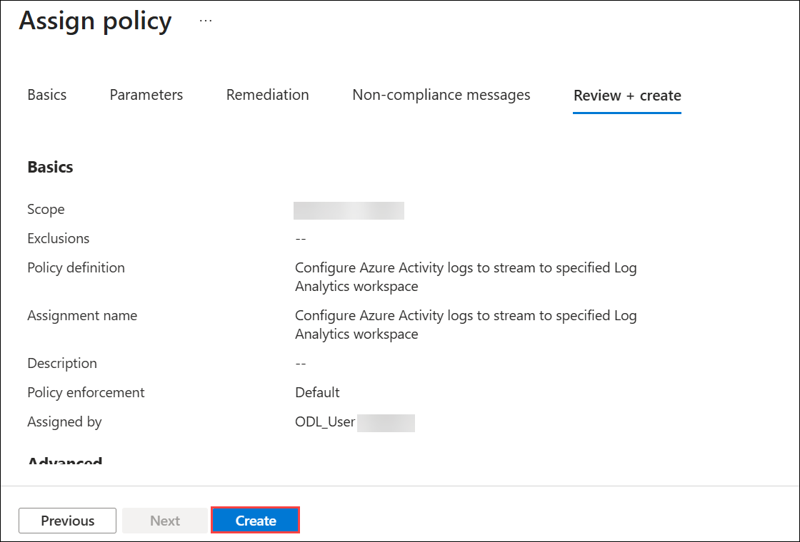 

    >**Note**: You can check the Notifications, bell icon to verify the three successful tasks.

1. Verify that the **Azure Activity** pane displays the **Data received** graph (you might have to refresh the browser page).  

    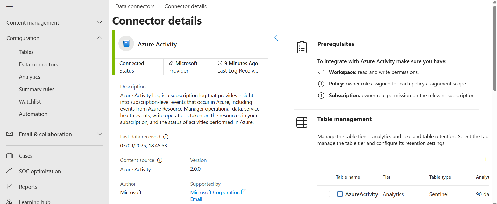 

    >**Note**: It may take over 15 minutes before the Status shows "Connected" and the graph displays Data received.

## Task 3: Create a rule that uses the Azure Activity data connector. 

In this task, you will review and create a rule that uses the Azure Activity data connector. 

1. In the **Microsoft Sentinel** section, expand **Configuration (1)**, select **Analytics (2)**.

1. On the **Analytics** blade, click the **Rule templates (3)** tab. 

    >**Note**: Review the types of rules you can create. Each rule is associated with a specific Data Source.

1. In the listing of rule templates, type **Suspicious** into the search bar form and click the **Suspicious number of resource creation or deployment (4)** entry associated with the **Azure Activity** data source. And then, in the pane displaying the rule template properties(click the > symbol (5) to view the pane), click **Create rule (6)** (you may need to zoom out a little to see the Create rule button)(scroll to the right of the page if needed).

     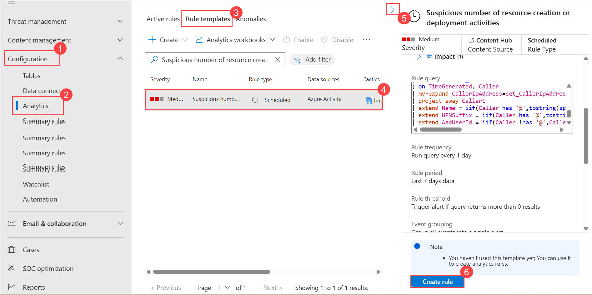

    >**Note**: This rule has the medium severity. 

1. On the **General** tab of the **Analytic rule wizard - Create a new Scheduled rule** blade, accept the default settings and click **Next: Set rule logic >**.

    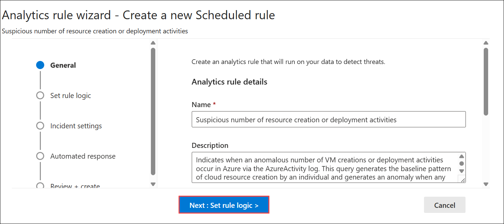

1. On the **Set rule logic** tab of the **Analytic rule wizard - Create a new Scheduled rule** blade, accept the default settings and click **Next: Incident settings >**.

    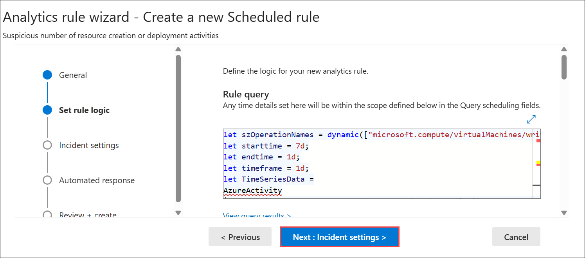

1. On the **Incident settings** tab of the **Analytic rule wizard - Create a new Scheduled rule** blade, accept the default settings and click **Next: Automated response >**. 

    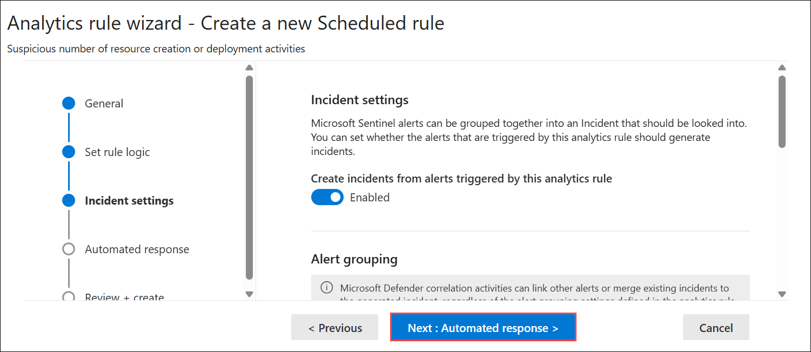

    >**Note**: This is where you can add a playbook, implemented as a Logic App, to a rule to automate the remediation of an issue.

1. On the **Automated response** tab of the **Analytic rule wizard - Create a new Scheduled rule** blade, accept the default settings and click **Next: Review and create >**. 

    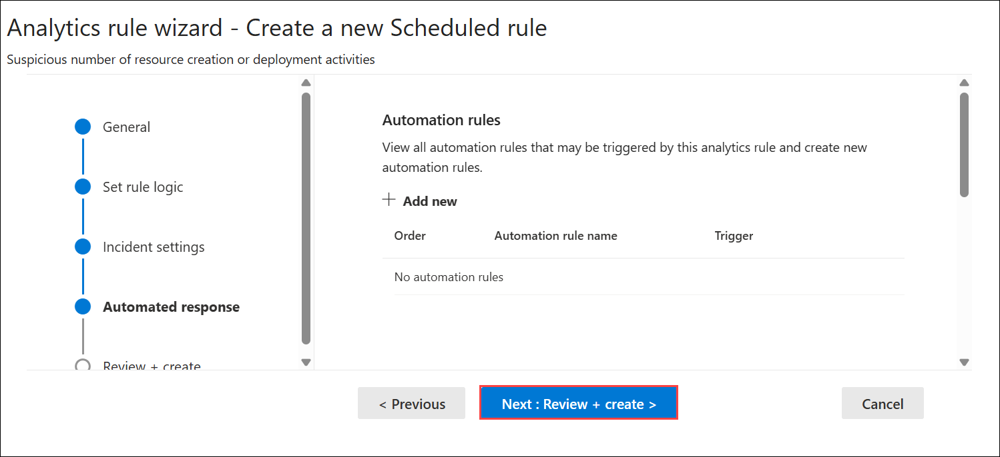

1. On the **Review and create** tab of the **Analytic rule wizard - Create a new Scheduled rule** blade, click **Save**.

    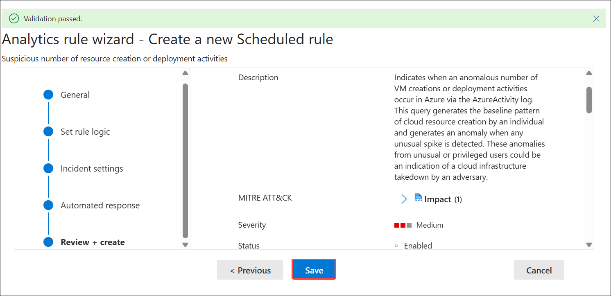

    >**Note**: You now have an active rule.

## Task 4: Create a playbook

In this task, you will create a playbook. A security playbook is a collection of tasks that can be invoked by Microsoft Sentinel in response to an alert. 

1. In the Azure portal, in the **Search resources, services, and docs** text box at the top of the Azure portal page, type **Deploy a custom template (1)** and select **Deploy a custom template (2)** from the services.

     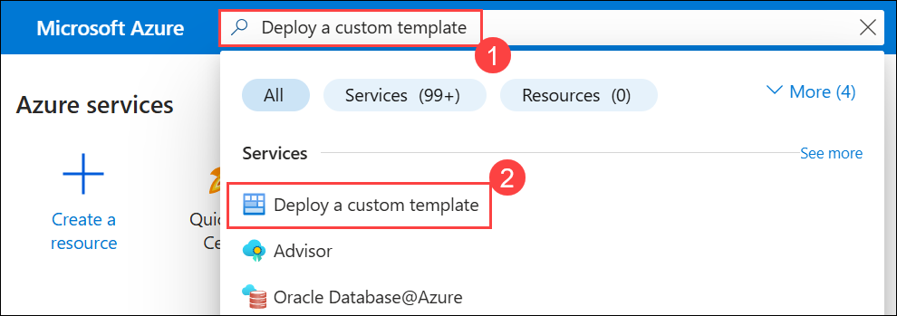

1. On the **Custom deployment** blade, click the **Build your own template in the editor** option.

     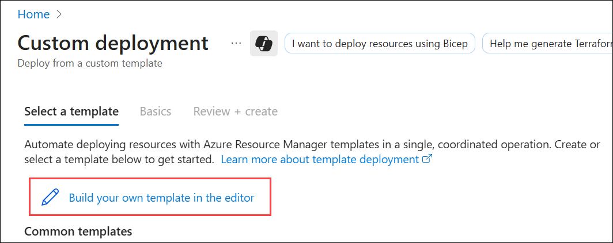

1. On the **Edit template** blade, click **Load file**, locate the **C:\\AllFiles\\AZ500-AzureSecurityTechnologies-lab-files\\Allfiles\\Labs\\15\\changeincidentseverity.json (1)** file, select **changeincidentseverity (2)** and click **Open (3)**.

    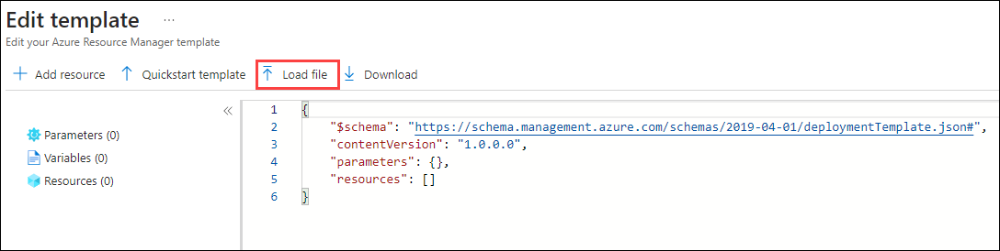

    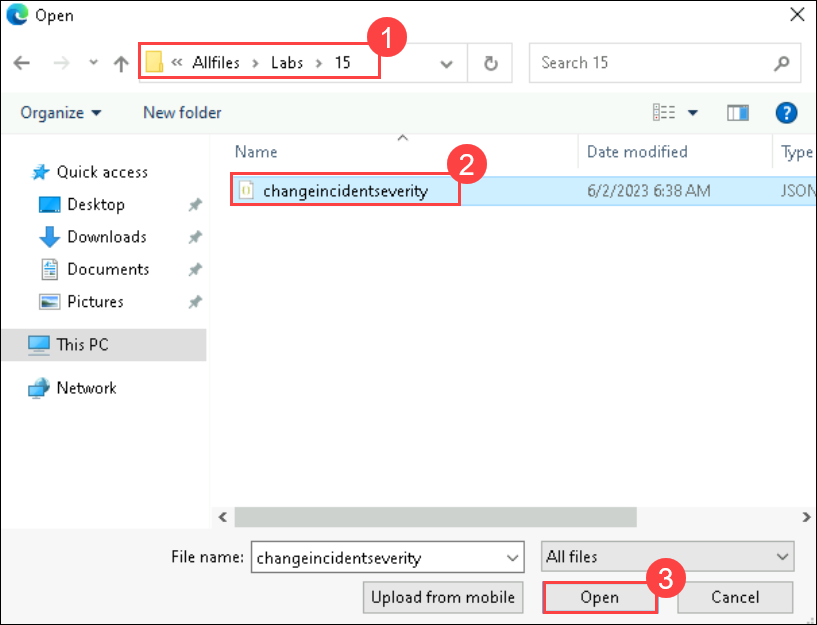

    >**Note**: You can find sample playbooks at [https://github.com/Azure/Azure-Sentinel/tree/master/Playbooks](https://github.com/Azure/Azure-Sentinel/tree/master/Playbooks).

1. On the **Edit template** blade, click **Save**.

1. On the **Custom deployment** blade, ensure that the following settings are configured (leave any others with their default values):

    |Setting|Value|
    |---|---|
    |Subscription|the name of the Azure subscription you are using in this lab **(1)**|
    |Resource group|**AZ500LAB080910 (2)**|
    |Location|**(US) East US (3)**|
    |Playbook Name|**Change-Incident-Severity (4)**|
    |User Name|your email address <inject key="AzureAdUserEmail"></inject> **(5)**|

1. Click **Review + create (6)** and then click **Create**.

    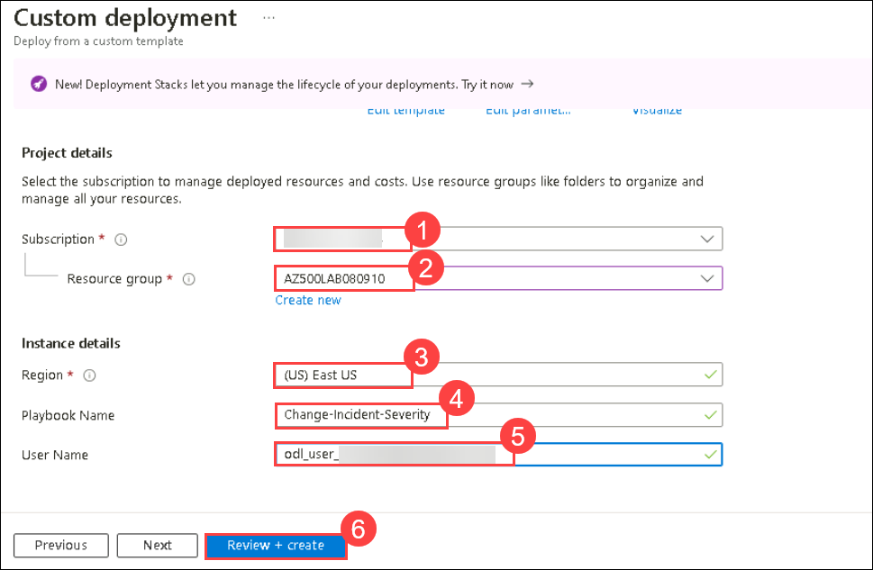

    >**Note**: Wait for the deployment to complete.

1. In the Azure portal, in the **Search resources, services, and docs** text box at the top of the Azure portal page, type **Resource groups (1)** and select **Resource groups (2)** from the services..

    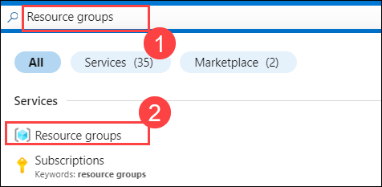

1. On the **Resource groups** blade, in the list of resource group, click the **AZ500LAB080910** entry.

    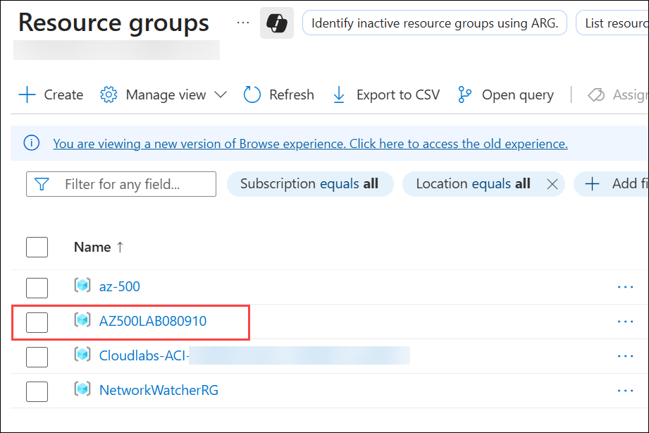

1. On the **AZ500LAB080910** resource group blade, in the list of resources, click the entry representing the newly created **Change-Incident-Severity** logic app.

    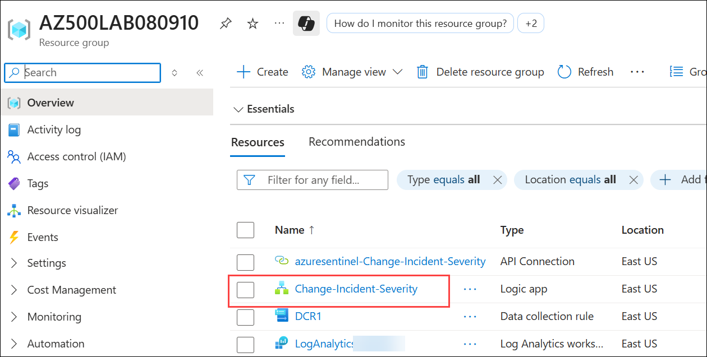

1. On the **Change-Incident-Severity** blade, click **Edit**.

    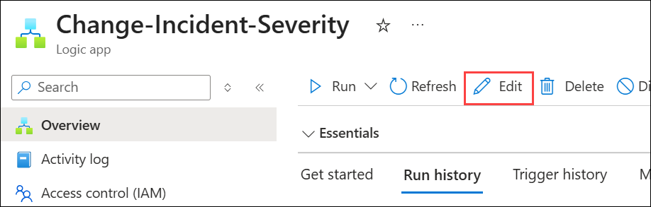

    >**Note**: On the **Logic Apps Designer** blade, each of the four connections displays a warning. This means that each needs to reviewed and configured.

1. On the **Logic Apps Designer** blade, click the first **Connections** step.

   >**Note** You need to click on **Change Connection** to add a new connection.

   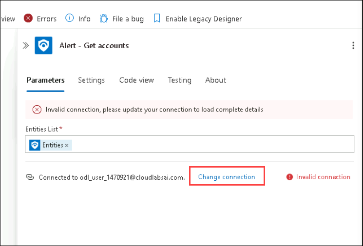

1. Click **Add new**, ensure that the entry in the **Tenant** drop down list contains your Azure AD tenant name and click **Sign-in**.

    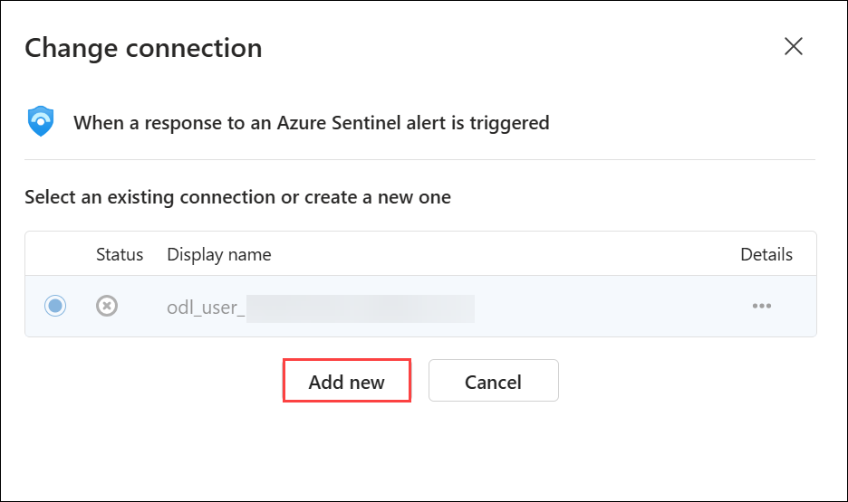

    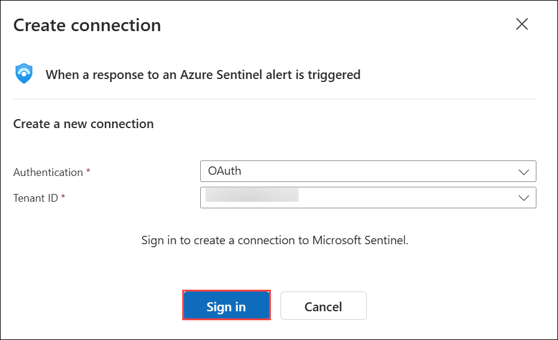

1. When prompted, sign in with the user account that has the Owner or Contributor role in the Azure subscription you are using for this lab.
		
1. Click the second **Connection** step and, click on **change connection**. In the list of connections, select the second entry, representing the connection you created in the previous step.	

1. Repeat the previous steps in for the remaining two **Connection** steps.

    >**Note**: Ensure there are no warnings displayed on any of the steps.

1. On the **Logic Apps Designer** blade, click **Save** to save your changes.

    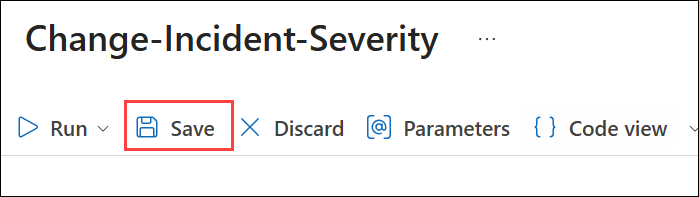

## Task 5 : Create a custom alert and configure a playbook as an automated response

1. We need to assign two roles to perform this task i.e. **Microsoft Sentinel Contributor** on Resource group **AZ500LAB080910** and **Logic App Contributor** on Logic app **Change-Incident-Severity**.

1. Go to the resource group from the portal and select Resource group **AZ500LAB080910**. Select **Access control (IAM) (1)** from the left pan and select **+ Add (2)** and choose **Add role assignment (3)** from the dropdown list.

     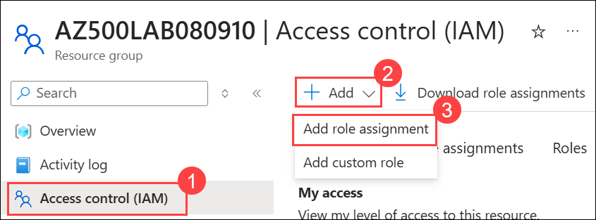

1. On the **Add role assignment** blade under Role tab search and select **Microsoft Sentinel Contributor (1)** role and select **Next (2)**.

    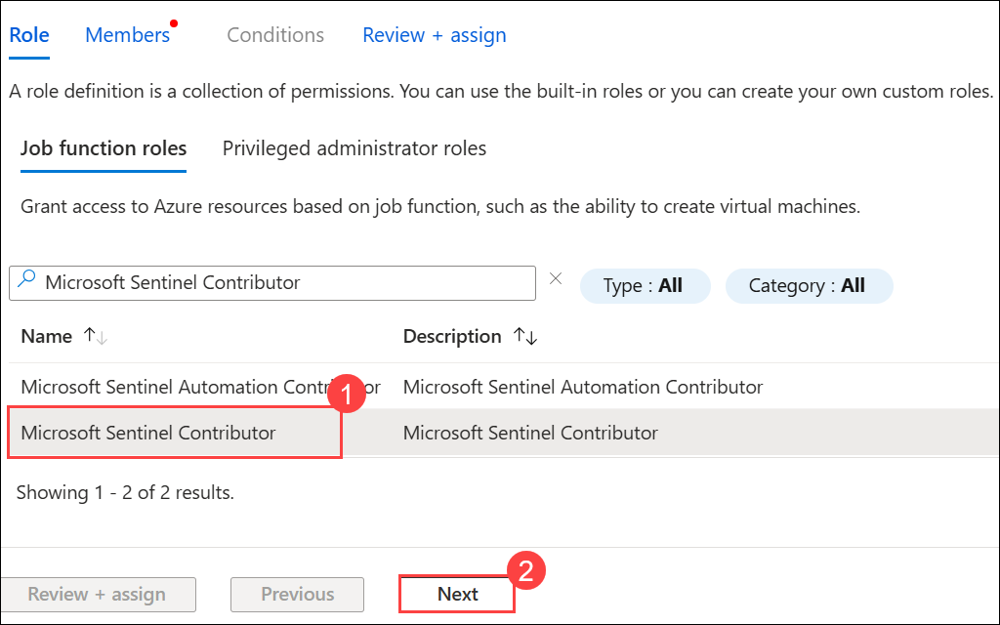

1. On the **Add role assignment** blade under Members tab, select **User, group, or service principal (1)** from Assign access to section. Click on  **+ Select members (2)** from Members section. from the new Select members tab search and select your user account i.e. **Email/Username:** <inject key="AzureAdUserEmail"></inject>

    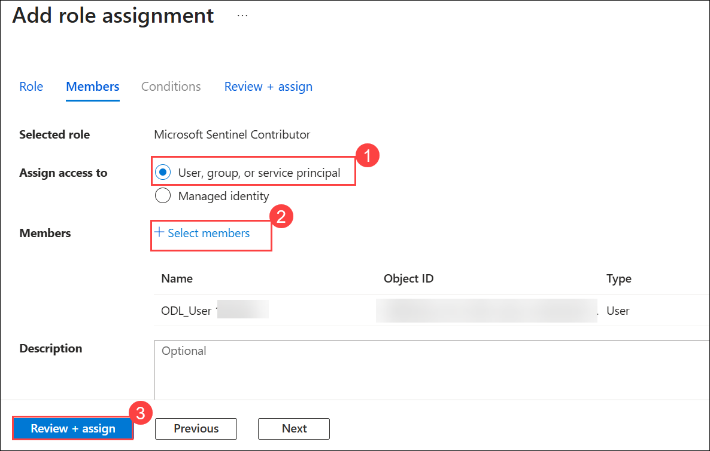

1. Click **Review + assign (3)** twice to create the role assignment.

1. Return back to **AZ500LAB080910** resource group and select **Change-Incident-Severity** logic app.

    

1. On the **Change-Incident-Severity** blade, click **Access control (IAM) (1)** from the left pan.

1. On the **Change-Incident-Severity | Access control (IAM)** blade, click **+ Add (2)** and then, in the drop-down menu, click **Add role assignment (3)**.

    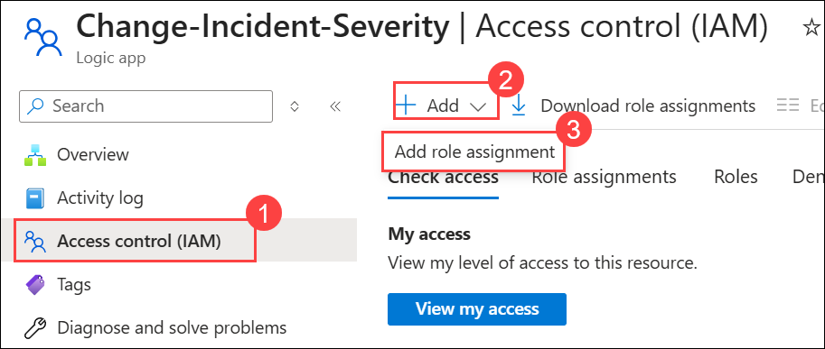

1. On the **Add role assignment** blade under Role tab search and select **Logic App Contributor (1)** role and select **Next (2)**.

    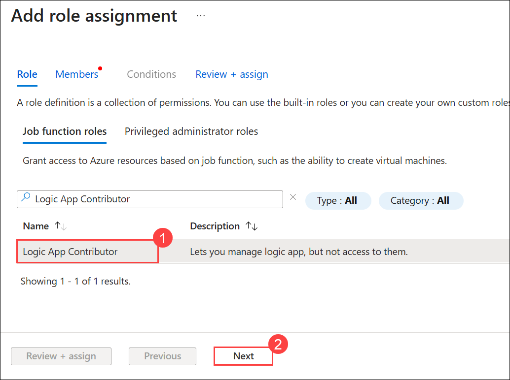

1. On the **Add role assignment** blade under Members tab, select **User, group, or service principal (1)** from Assign access to section. Click on  **+ Select members (2)** from Members section. from the new Select members tab search and select your user account i.e. **Email/Username:** <inject key="AzureAdUserEmail"></inject>

1. Click **Review + assign (3)** twice to create the role assignment.

    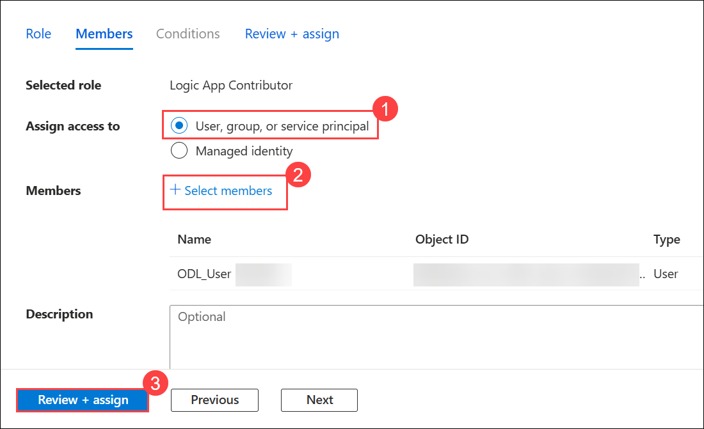

1. In the Azure portal, navigate back to the **Microsoft Sentinel | Settings (1)** blade and select **Settings (2)** tab. Then, from **Playbook permissions** select **Configure permissions (1)**. Select **AZ500LAB080910 (2)** resource group entry then click on **Apply (3)**. Wait till permission has been assigned.

    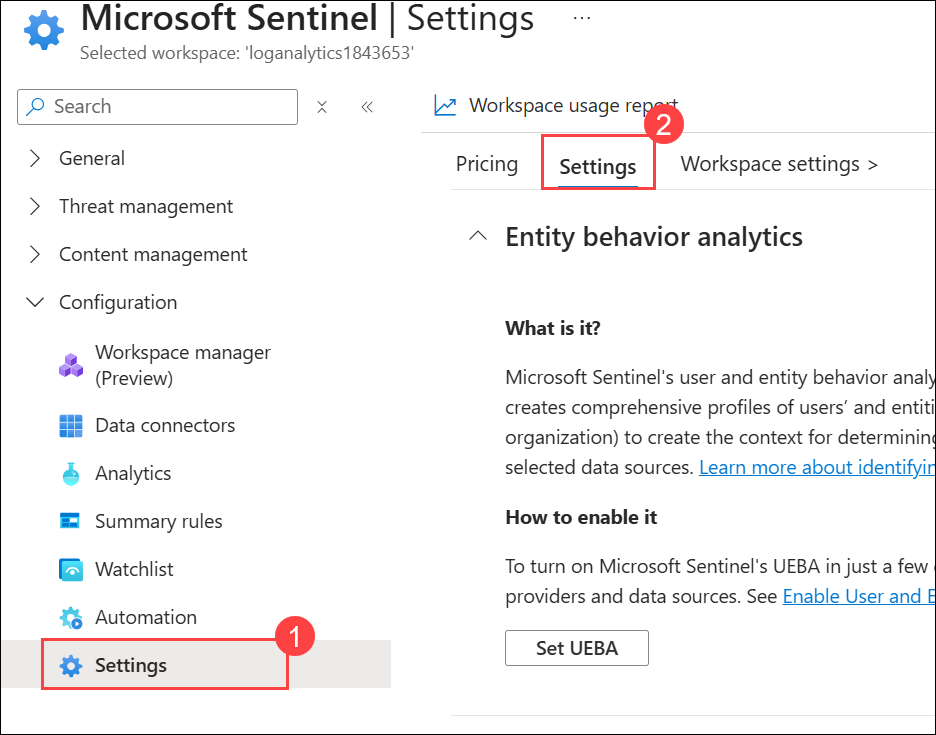

    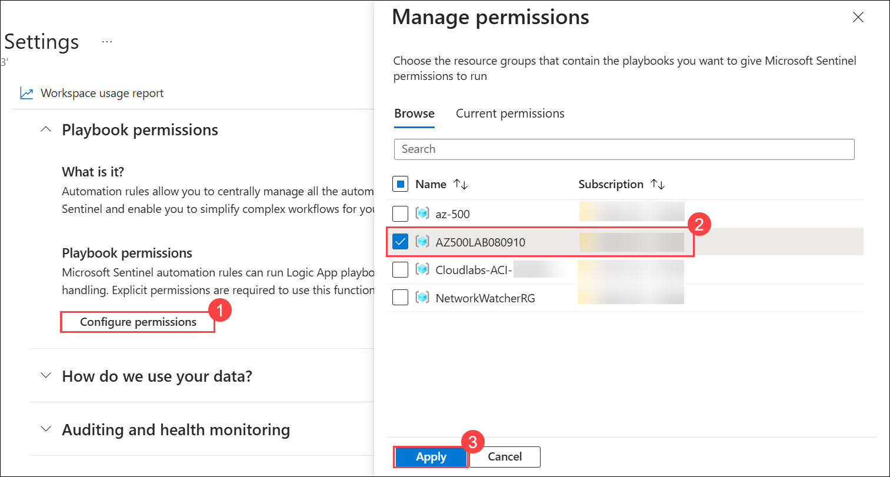

1.  Navigate to **Microsoft Defender** portal, expand **Configuration (1)** section, click **Analytics (2)**.

1. On the **Analytics** blade, click **+ Create (3)** and, in the drop-down menu, click **Scheduled query rule (4)**. 

    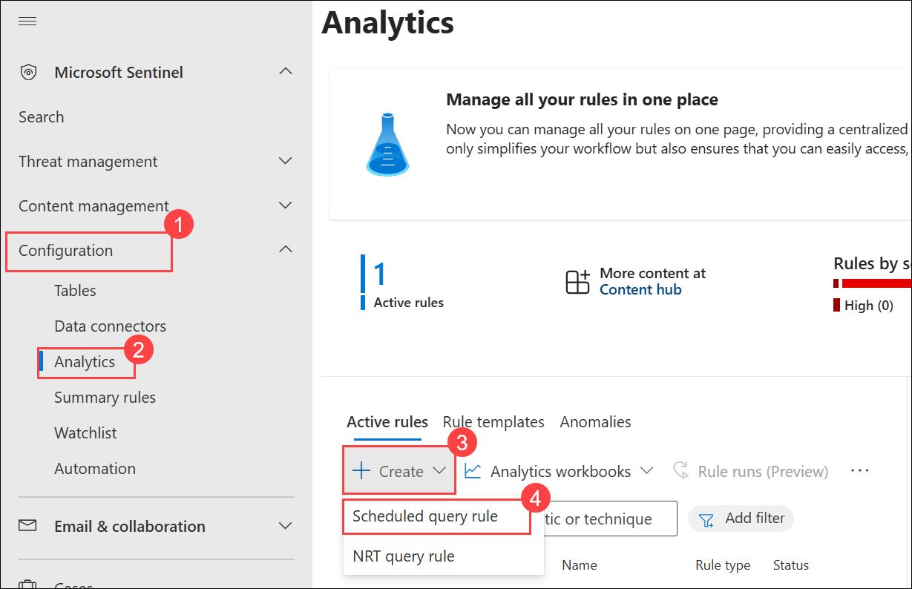

1. On the **General** tab of the **Analytic rule wizard - Create a new Scheduled rule** blade, specify the following settings (leave others with their default values):

    |Setting|Value|
    |---|---|
    |Name|**Playbook Demo (1)**|
    |MITRE ATT&CK|**Initial Access (2)**|

1. Click **Next: Set rule logic > (3)**.

     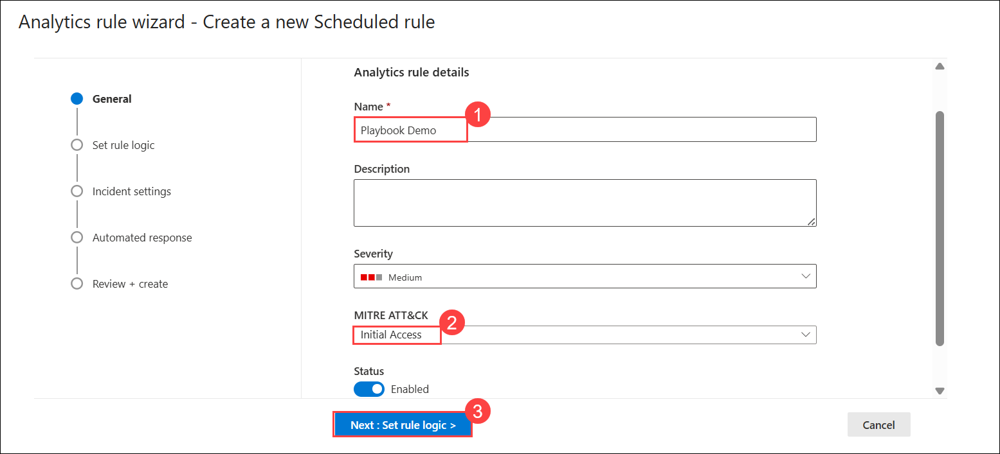

1. On the **Set rule logic** tab of the **Analytic rule wizard - Create a new Scheduled rule** blade, in the **Rule query** text box, paste the following rule query **(1)**. 

    ```
    AzureActivity
     | where ResourceProviderValue =~ "Microsoft.Security" 
     | where OperationNameValue =~ "Microsoft.Security/locations/jitNetworkAccessPolicies/delete" 
    ```

    >**Note**: This rule identifies removal of Just in time VM access policies.

    >**Note**: If you receive a parse error, intellisense may have added values to your query. Ensure the query matches otherwise paste the query into notepad and then from notepad to the rule query. 

1. On the **Set rule logic** tab of the **Analytic rule wizard - Create a new Scheduled rule** blade, in the **Query scheduling** section, set the **Run query every** and **Lookup data from the last** to **5 Minutes (2)**.

     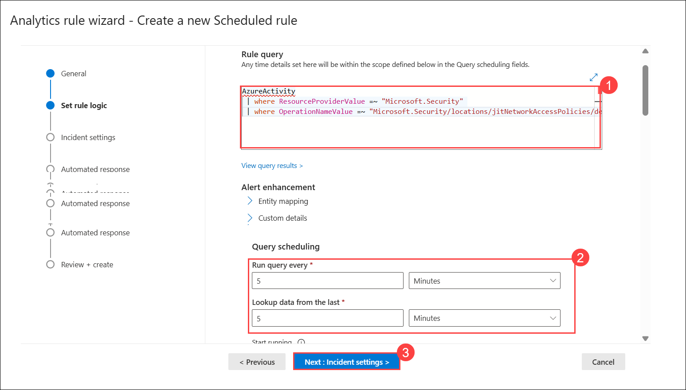

1. On the **Set rule logic** tab of the **Analytic rule wizard - Create a new Scheduled rule** blade, accept the default values of the remaining settings and click **Next: Incident settings > (3)**.

1. On the **Incident settings** tab of the **Analytic rule wizard - Create a new Scheduled rule** blade, accept the default settings and click **Next: Automated response >**.

    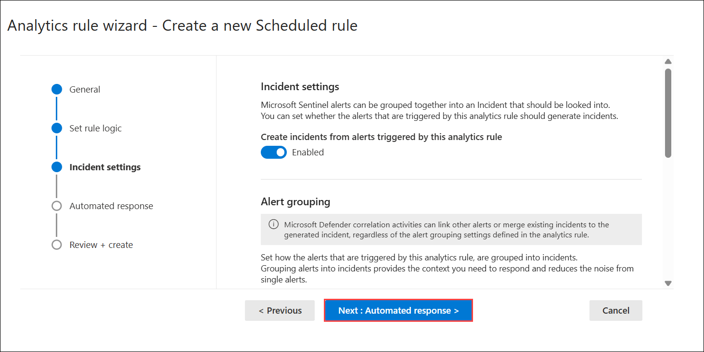

1. Click **Next: Review and create >** and click **Save**

    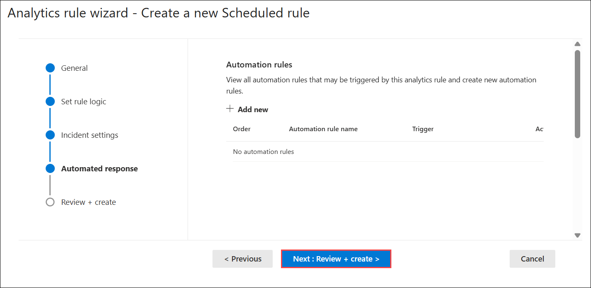

    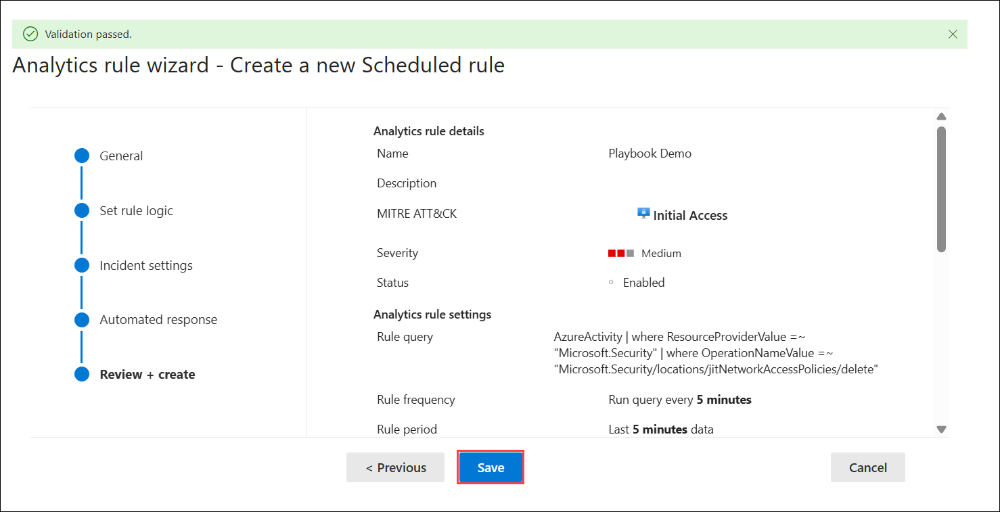

1. In the **Microsoft Sentinel** section, expand **Configuration (1)** select **Automation (2)**, click **Create (3)** and choose **Playbook with alert trigger (4)** from dropdown list.

    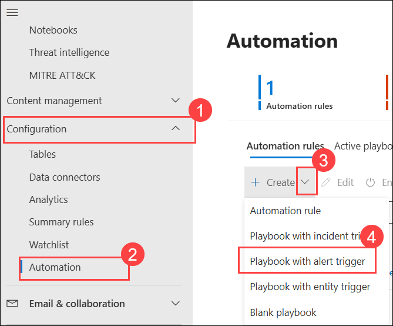

1. On the basics tab, provide the following details:

    - Resource group: **AZ500LAB080910 (1)**
    - Playbook name: Enter **Change-Incident-Severity (2)**
    - Enable diagonstic logs in Logs Analytics **(3)**
    - Select **Next:Connections (4)**

      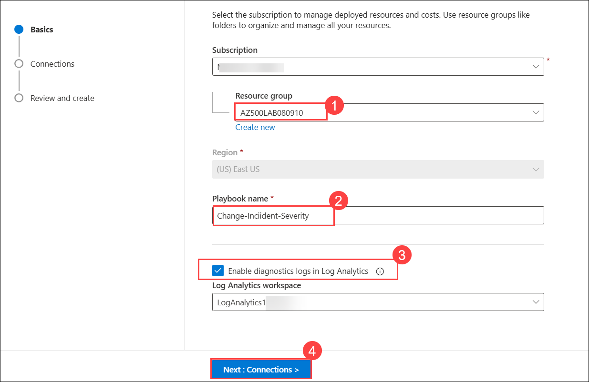  

1. Expand **Microsoft Sentinal (1)** and select **<inject key="AzureAdUserEmail"></inject> (2)** and then click **Next: Review and create (3)**.

    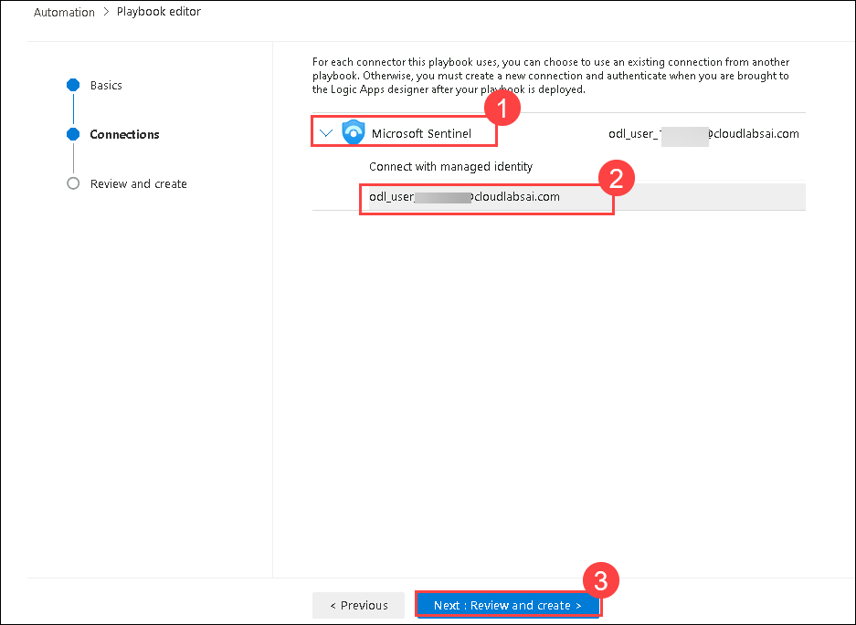

1. Select **Create playbook**.

    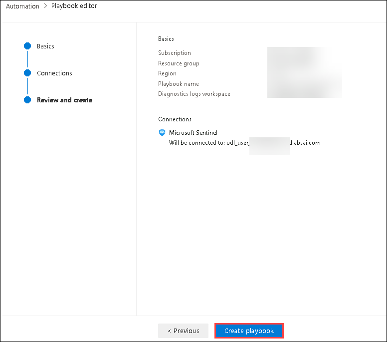

1. Navigate back to **Automation** page.    

1. In the **Microsoft Sentinel** section, expand **Configuration (1)** select **Automation (2)**, click **Create (3)** and choose **Automation Rule (4)** from dropdown list.

    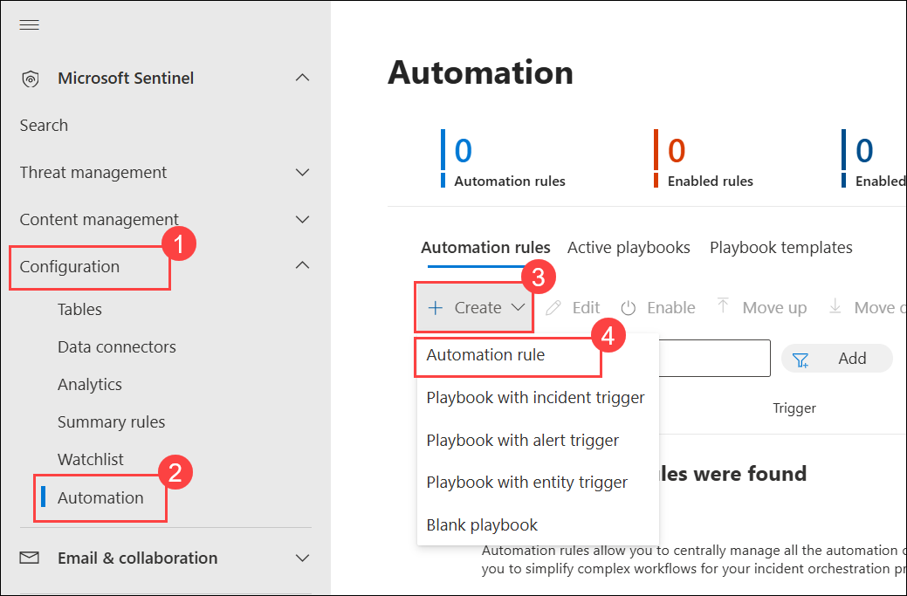

1. On new automation rule page,

    - Automation rule name: Enter **Run Change-Severity Playbook (1)**
    - Under the **Trigger** field, click the drop-down menu and select **When alert is created (2)**
    - Select **Change-Incident-Severity (3)** playbook from the drop down
    - Select **Apply (4)**

      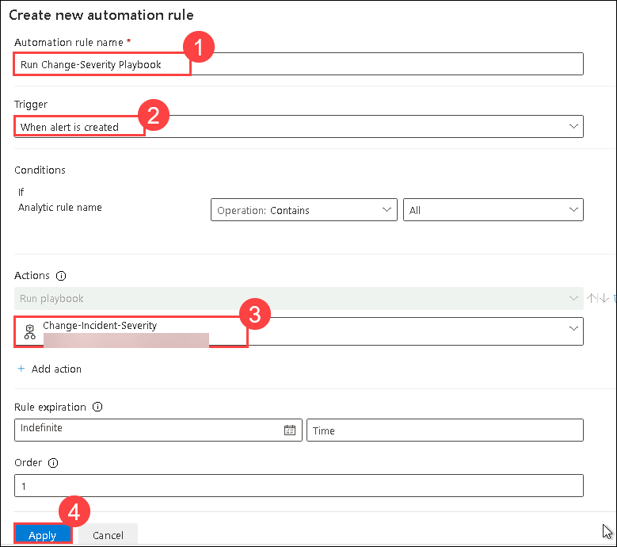

>**Note**: You now have a new active rule called **Playbook Demo**. If an event identified by the rue logic occurs, it will result in a medium severity alert, which will generate a corresponding incident.      

## Task 6: Invoke an incident and review the associated actions.

1. In the Azure portal, navigate to the **Microsoft Defender for Cloud \| Overview** blade.

    >**Note**: Check your secure score. By now it should have updated.

1. On the **Microsoft Defender for Cloud \| Overview** blade, under **Cloud Security** select **Workload protections (1)** section.

    - On the **Microsoft Defender for Cloud \| Workload protections** blade under **Advanced protection** select **Just-in-time VM access (2)**.

      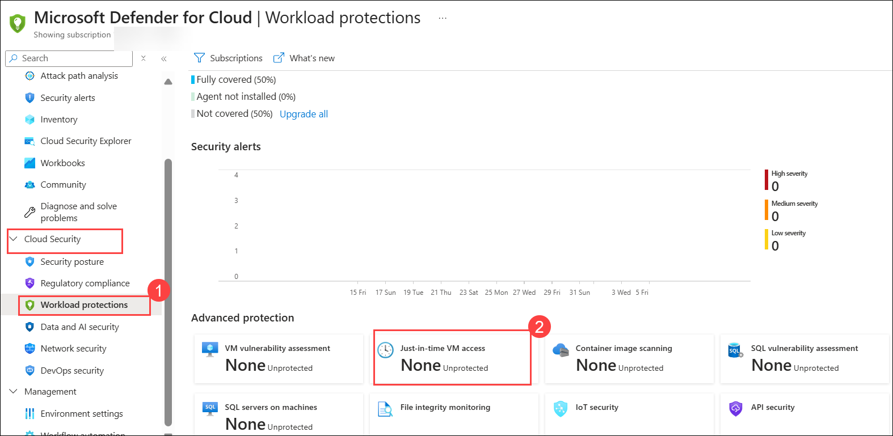    

1. On the **Just in time VM access** blade, under the **Configured (1)** blade, on the right hand side of the row referencing the **myVM** virtual machine, click the ***ellipsis (...) (2)** button,  click **Remove (3)**. 

    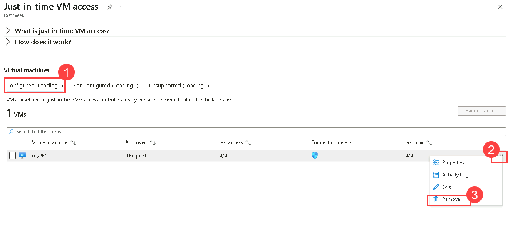

1. Then click **Yes**.

    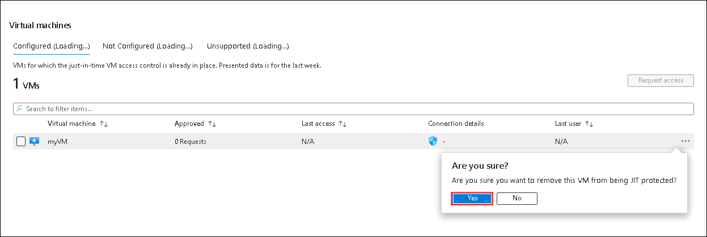

     >**Note:** If the VM is not listed in the **Just-in-time VMs**, navigate to **Virutal Machine** blade and click the **Configuration**, Click the **Enable the Just-in-time VMs** option under the **Just-in-time Vm's access**. Repeat the above step to navigate back to the **Microsoft Defender for Cloud** and refresh the page, the VM will appear.

1. In the Azure portal, in the **Search resources, services, and docs** text box at the top of the Azure portal page, type **Activity log** and press the **Enter** key.

1. On the **Activity log** blade, note an **Delete JIT Network Access Policies** entry.   This may take a few minutes to appear. **Refresh** the page if it does not appear. You can also try to search for the entry in Activity logs. 

    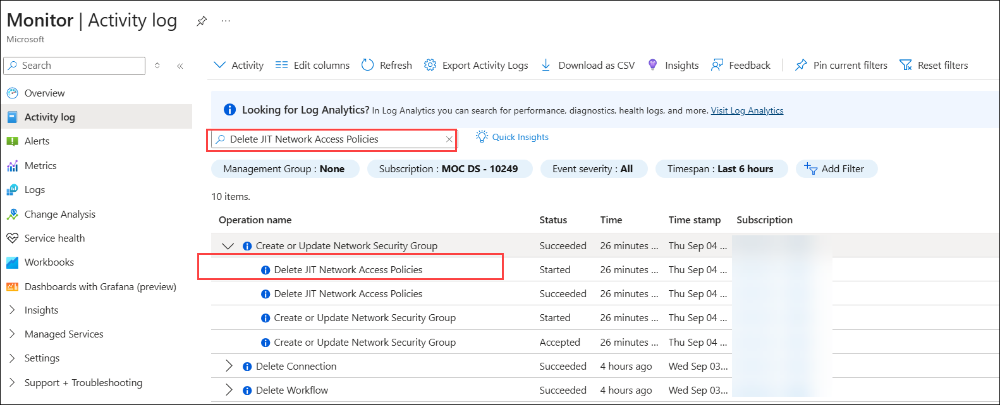
    
1. Navigate back to the **Microsoft Defender** portal.

1. Expand **Investigation and response (1)**, then **Incidents and alerts (2)**. Choose **Alerts (3)** and then review the dashboard and verify that it displays an alert corresponding to the deletion of the Just in time VM access policy **(4)**.

    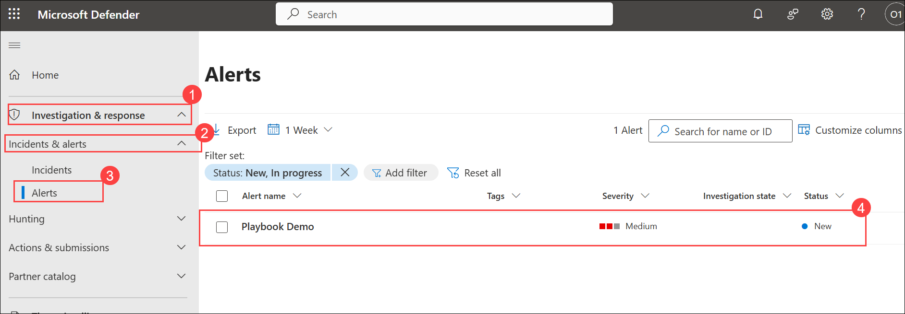

     >**Note**: It can take up to 5 minutes for alerts to appear on the **alerts** blade. If you are not seeing an alert at that point, run the query rule referenced in the previous task to verify that the Just In Time access policy deletion activity has been propagated to the Log Analytics workspace associated with your Microsoft Sentinel instance. If that is not the case, re-create the Just in time VM access policy and delete it again.

1. Select **Incidents (1)**. Verify that the blade displays an incident with either medium or high severity level **(2)**.

    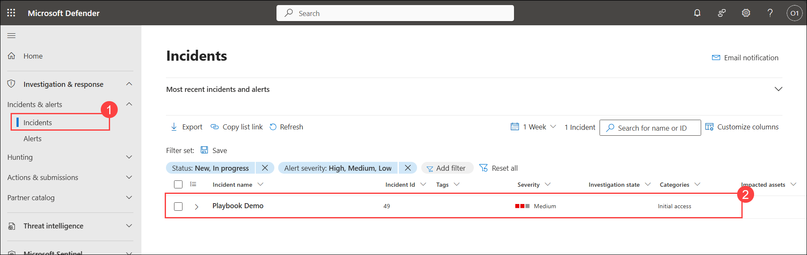

     >**Note**: It can take up to 5 minutes for the incident to appear on the **Incident** blade. 

    >**Note**: You have the option of assigning a different severity level and status to an incident.

> **Results:** You have created an Microsoft Sentinel workspace, connected it to Azure Activity logs, created a playbook and custom alerts that are triggered in response to the removal of Just in time VM access policies, and verified that the configuration is valid.

> **Congratulations** on completing the task! Now, it's time to validate it. Here are the steps:
   - If you receive a success message, you can proceed to the next task.
   - If not, carefully read the error message and retry the step, following the instructions in the lab guide.
   - If you need any assistance, please contact us at cloudlabs-support@spektrasystems.com. We are available 24/7 to help you out.
 
   <validation step="61d471a2-0512-4d07-9e23-7393e56ef937" />
 
### You have successfully completed the lab
